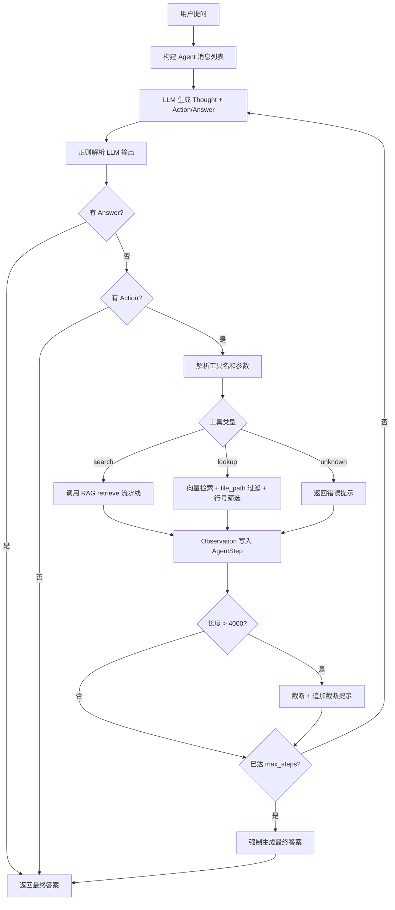
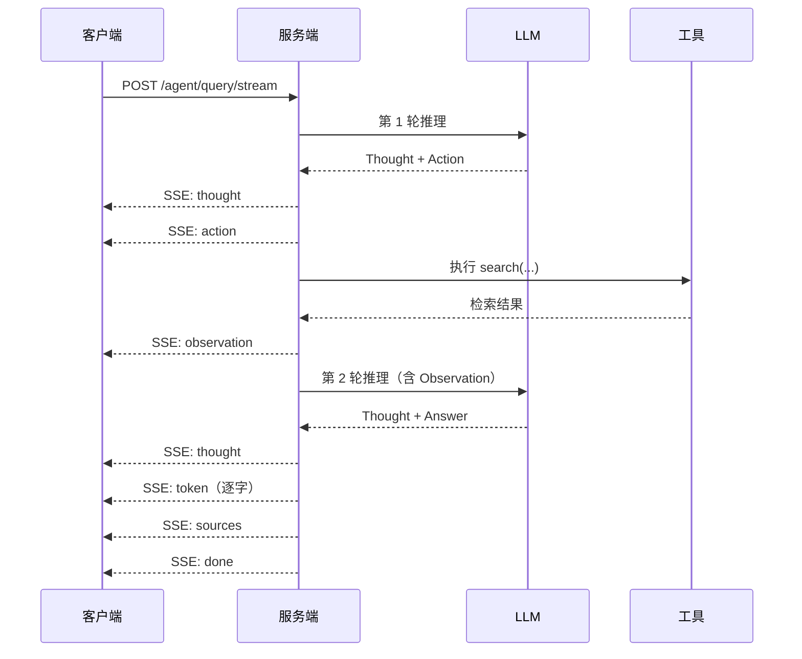
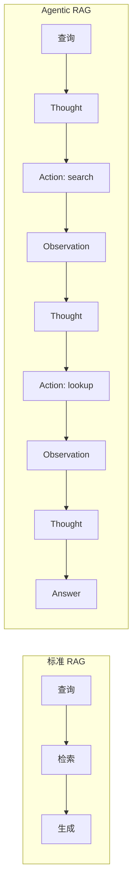

# Agentic RAG 多步推理

## 概述

标准 RAG 流程是单轮检索：一次查询、一次生成。面对需要多跳推理的复杂问题（如"这个函数的调用者在哪里处理了异常？"），单轮检索往往无法一次性获取足够上下文。

Agentic RAG 在标准 RAG 之上引入 ReAct（Reasoning + Acting）循环，让 LLM 自主决定何时检索、检索什么、是否需要进一步查看源码，直到收集到足够信息后再生成最终答案。

核心实现位于 `src/delphi/retrieval/agent.py`，API 路由位于 `src/delphi/api/routes/agent.py`。

## ReAct 模式

Agent 采用 Thought → Action → Observation 循环：

```
Thought: 分析当前情况，决定下一步
Action: tool_name(args)
Observation: 工具返回的结果
...（重复直到信息充分）
Thought: 我已经收集到足够信息
Answer: 最终回答
```

LLM 输出通过正则解析提取各字段：

```python
_THOUGHT_RE = re.compile(r"Thought\s*[:：]\s*(.+?)(?=\n(?:Action|Answer)\s*[:：]|\Z)", re.DOTALL)
_ACTION_RE  = re.compile(r"Action\s*[:：]\s*(.+?)(?=\n|$)")
_ANSWER_RE  = re.compile(r"Answer\s*[:：]\s*(.+)", re.DOTALL)
```

### 容错解析

解析对格式不规范的 LLM 输出做了容错处理：

- 没有 `Thought:` 标记 → 将 Action/Answer 之前的全部文本视为 thought
- 同时出现 `Action:` 和 `Answer:` → 优先取 Answer（认为 LLM 已准备好回答）

每一步执行记录为 `AgentStep` 数据结构：

```python
@dataclass
class AgentStep:
    thought: str                  # LLM 的推理过程
    action: str | None = None     # 调用的工具及参数
    observation: str | None = None  # 工具返回结果
    answer: str | None = None     # 最终答案（仅最后一步）
```

## 工具定义

Agent 拥有两个工具，覆盖"搜索"和"精确查看"两种检索模式：

### search(query)

在知识库中执行语义检索，调用标准 RAG retrieve 流水线（Embedding → 向量检索 → Reranker）。

```
Action: search(retrieve 函数的实现)
```

返回格式化的 Top-N 检索结果，包含文件路径、行号和代码片段。

### lookup(file_path, start_line, end_line)

查看特定文件的指定行范围。通过向量检索 + `file_path` 过滤 + 行号范围交集筛选实现。

```
Action: lookup("src/delphi/retrieval/rag.py", 10, 50)
```

::: tip 两个工具的配合
典型使用模式：先用 `search` 定位相关代码片段，再用 `lookup` 查看上下文或关联代码的具体实现。这模拟了开发者"先搜索、再跳转查看"的自然工作流。
:::

## 执行流程



### 强制终止机制

当循环达到 `max_steps` 上限时，`_force_final_answer` 将所有已收集的 Observation 拼入上下文，并追加指令要求 LLM 直接给出答案：

```
你已经进行了多步检索，请根据已收集到的所有信息，直接给出最终答案。不要再调用工具。
```

如果此时 LLM 调用仍然失败，回退策略是将所有 Observation 拼接作为答案返回。

::: warning Observation 截断
每步工具返回的 Observation 超过 4000 字符时会被截断，避免上下文窗口溢出。截断后追加 `...(结果已截断)` 标记。
:::

## API 接口

### POST /agent/query

非流式查询，等待 Agent 完成所有推理步骤后返回完整结果。

请求体：

```json
{
    "question": "retrieve 函数如何处理 Graph RAG 扩展？",
    "project": "delphi",
    "max_steps": 5,
    "session_id": null
}
```

响应体：

```json
{
    "answer": "retrieve 函数通过 ...",
    "steps": [
        {
            "thought": "我需要先找到 retrieve 函数的实现",
            "action": "search(retrieve 函数实现)",
            "observation": "[1] src/delphi/retrieval/rag.py (行 45-90)\n...",
            "answer": null
        }
    ],
    "sources": [
        { "index": 1, "file": "src/delphi/retrieval/rag.py" }
    ],
    "session_id": "uuid-xxx"
}
```

### POST /agent/query/stream

流式查询，通过 SSE 实时推送每一步推理过程。请求体与非流式接口相同。

## 流式响应格式

流式接口通过 Server-Sent Events 推送以下事件类型：

| 事件类型 | 触发时机 | 数据字段 |
|---------|---------|---------|
| `thought` | LLM 输出 Thought | `{ "type": "thought", "content": "..." }` |
| `action` | LLM 决定调用工具 | `{ "type": "action", "tool": "search", "args": "search(...)" }` |
| `observation` | 工具执行完成 | `{ "type": "observation", "content": "..." }` |
| `token` | 流式输出最终答案 | `{ "type": "token", "content": "字" }` |
| `sources` | 答案生成完毕 | `{ "type": "sources", "sources": [...] }` |
| `done` | 整个流程结束 | `{ "type": "done", "session_id": "uuid-xxx" }` |

事件流时序示意：



::: tip Session 管理
两个接口都支持 `session_id` 参数。首次请求不传 `session_id`，服务端自动创建 session 并在响应中返回。后续请求携带该 ID 即可实现多轮对话，Agent 会将历史对话纳入上下文。
:::

## 配置参数

| 参数 | 位置 | 默认值 | 说明 |
|------|------|--------|------|
| `max_steps` | API 请求体 | `5` | Agent 最大推理步数，超过后强制生成答案 |
| `project` | API 请求体 | `""` | 目标知识库（对应 Qdrant collection） |
| `session_id` | API 请求体 | `null` | 会话 ID，用于多轮对话 |
| `chunk_top_k` | `settings` | 全局配置 | search 工具调用 retrieve 时的候选数量 |
| `vllm_url` | `settings` | 全局配置 | vLLM 推理服务地址 |
| `llm_model` | `settings` | 全局配置 | 使用的 LLM 模型名称 |

::: warning max_steps 调优
`max_steps` 过小会导致复杂问题信息不足，过大会增加延迟和 token 消耗。对于代码知识库场景，默认值 5 通常足够覆盖"搜索 → 查看 → 再搜索 → 回答"的典型路径。如果知识库规模很大或问题涉及多文件跳转，可适当调高到 8-10。
:::

## 与标准 RAG 的对比

| 维度 | 标准 RAG | Agentic RAG |
|------|---------|-------------|
| 检索次数 | 固定 1 次 | 动态 1-N 次，由 LLM 决定 |
| 推理模式 | 单轮：检索 → 生成 | 多轮：Thought → Action → Observation 循环 |
| 工具能力 | 无 | search（语义检索）+ lookup（精确查看） |
| 适用场景 | 单跳事实性问题 | 多跳推理、跨文件分析、调用链追踪 |
| 延迟 | 低（1 次 LLM 调用） | 较高（N 次 LLM 调用 + N 次工具执行） |
| Token 消耗 | 低 | 较高（每步累积上下文） |
| 答案质量 | 依赖单次检索命中率 | 可迭代补充信息，答案更完整 |
| 可观测性 | 仅最终答案 | 每步 Thought/Action/Observation 可追踪 |



::: tip 何时使用 Agentic RAG
并非所有查询都需要 Agentic RAG。对于简单的事实性问题（如"这个函数的参数是什么"），标准 RAG 已经足够且更快。Agentic RAG 的价值在于需要多步推理的场景：跨文件调用链分析、异常处理路径追踪、架构设计理解等。可以在前端根据问题复杂度自动选择调用 `/query` 还是 `/agent/query`。
:::
