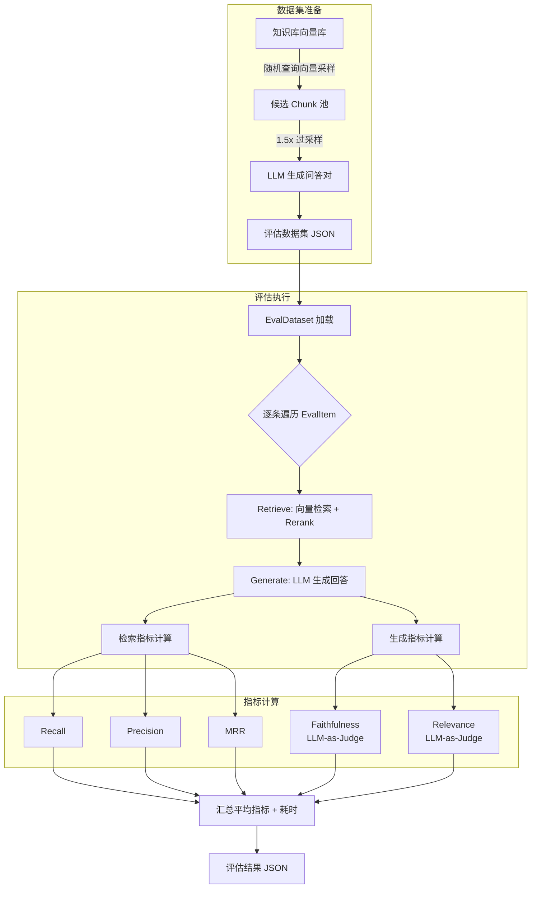

# 评估流水线

## 概述

Delphi 内置了完整的 RAG 评估流水线，用于量化衡量检索质量和生成质量。评估模块位于 `src/delphi/evaluation/`，包含三个核心组件：

- **指标计算**（`metrics.py`）：5 项评估指标，覆盖检索和生成两个维度
- **数据集生成**（`dataset.py`）：从已有知识库自动生成评估数据集，无需人工标注
- **评估执行器**（`runner.py`）：端到端运行 检索 → 生成 → 评估 流水线

评估结果以 JSON 格式输出，包含逐条明细和汇总指标，便于持续追踪 RAG 系统的质量变化。

## 评估流水线架构



## 指标详解

评估指标分为两类：**检索指标**（基于 chunk ID 精确匹配计算）和**生成指标**（基于 LLM-as-Judge 判断）。

### 检索指标

#### Retrieval Recall（检索召回率）

衡量相关文档被检索到的比例。召回率越高，说明系统遗漏的相关内容越少。

$$
\text{Recall} = \frac{|\text{Retrieved} \cap \text{Relevant}|}{|\text{Relevant}|}
$$

- 分母为标注的相关 chunk 总数
- 分子为检索结果中命中相关 chunk 的数量
- 取值范围 `[0.0, 1.0]`，无相关标注时返回 `0.0`

#### Retrieval Precision（检索精确率）

衡量检索结果中相关文档的占比。精确率越高，说明检索噪声越少。

$$
\text{Precision} = \frac{|\text{Retrieved} \cap \text{Relevant}|}{|\text{Retrieved}|}
$$

- 分母为检索返回的 chunk 总数
- 分子为其中属于相关集合的数量
- 取值范围 `[0.0, 1.0]`，无检索结果时返回 `0.0`

#### Retrieval MRR（平均倒数排名）

衡量第一个相关结果出现的位置。MRR 越高，说明用户越快看到有用内容。

$$
\text{MRR} = \frac{1}{\text{rank of first relevant result}}
$$

- 遍历检索结果列表，找到第一个属于相关集合的 chunk
- 返回其排名的倒数（排名从 1 开始）
- 若检索结果中无相关 chunk，返回 `0.0`

### 生成指标

生成指标采用 LLM-as-Judge 方式，由 LLM 对生成结果进行二元判断。

#### Generation Faithfulness（生成忠实度）

判断生成的回答是否忠实于检索到的上下文，检测幻觉问题。

$$
\text{Faithfulness} = \begin{cases} 1.0 & \text{LLM 判定 faithful} \\ 0.0 & \text{LLM 判定 unfaithful} \end{cases}
$$

- 将所有检索到的上下文拼接后与生成回答一起提交给 LLM
- LLM 判断回答中的关键信息是否都能在上下文中找到依据
- 包含上下文中没有的信息或与上下文矛盾则判定为 `unfaithful`

#### Generation Relevance（生成相关性）

判断生成的回答是否与用户的原始问题相关。

$$
\text{Relevance} = \begin{cases} 1.0 & \text{LLM 判定 relevant} \\ 0.0 & \text{LLM 判定 irrelevant} \end{cases}
$$

- 将用户问题与生成回答一起提交给 LLM
- LLM 判断回答是否直接回应了用户的问题
- 偏离主题或未回答问题则判定为 `irrelevant`

## 数据集自动生成

评估数据集可从已有知识库自动生成，无需人工标注，降低评估门槛。

### 生成流程

1. **随机采样 Chunk**：通过多样化查询向量（`代码实现`、`函数定义`、`配置说明`、`接口文档`、`错误处理`、`数据结构` 等 12 种语义方向）在向量库中检索，近似实现随机采样
2. **过采样策略**：按目标数量的 1.5 倍采样 chunk，预留生成失败的余量
3. **LLM 生成问答对**：对每个 chunk 调用 LLM 生成一组自然的问答对
4. **质量过滤**：跳过内容过短（< 50 字符）的 chunk，丢弃 JSON 解析失败的结果
5. **达标截断**：收集到目标数量后立即停止

### 数据集格式

```json
{
  "project_id": "my-project",
  "items": [
    {
      "question": "RerankerClient 的初始化参数有哪些？",
      "ground_truth_answer": "RerankerClient 接受 model_name 和 ...",
      "relevant_chunk_ids": ["src/retrieval/rag.py:45-78"]
    }
  ]
}
```

### Chunk ID 格式

每个 chunk 的唯一标识为 `file_path:start_line-end_line`，例如 `src/retrieval/rag.py:45-78`，用于在评估时精确匹配检索结果与标注答案。

## 评估执行流程

### 核心数据结构

| 类 | 字段 | 说明 |
|---|---|---|
| `EvalItem` | `question`, `ground_truth_answer`, `relevant_chunk_ids` | 单条评估输入 |
| `EvalDataset` | `project_id`, `items` | 评估数据集，支持从 JSON 加载 |
| `EvalResult` | `question`, `answer`, `retrieved_ids`, `recall`, `precision`, `mrr`, `faithfulness`, `relevance` | 单条评估结果，包含全部 5 项指标 |

### 执行步骤

对数据集中的每条 `EvalItem`，依次执行：

1. **Retrieve**：调用 RAG 检索流水线（向量检索 + Reranker 精排），获取 Top-K chunk
2. **Generate**：将检索到的 chunk 组装为 prompt，调用 LLM 生成回答
3. **Evaluate**：计算 3 项检索指标（recall / precision / mrr）和 2 项生成指标（faithfulness / relevance）

全部评估完成后，汇总输出：

- 各指标的平均值（保留 4 位小数）
- 总评估条数和总耗时
- 逐条评估明细

### CLI 使用

```bash
# 从知识库自动生成评估数据集（默认 50 条）
delphi eval generate --project my-project --num 50 --output eval_dataset.json

# 运行评估
delphi eval run eval_dataset.json --project my-project --output eval_result.json
```

### API 接口

| 方法 | 路径 | 说明 |
|---|---|---|
| `POST` | `/eval/generate` | 生成评估数据集 |
| `POST` | `/eval/run` | 运行评估流水线 |

## 结果分析与优化建议

### 指标解读参考

| 指标 | 理想值 | 低分可能原因 |
|---|---|---|
| Recall | > 0.8 | chunk 切分粒度过大、embedding 模型对该领域表达不佳、Top-K 设置过小 |
| Precision | > 0.6 | 检索噪声多、缺少 Reranker 精排、元数据过滤未启用 |
| MRR | > 0.7 | 相关结果排序靠后、Reranker 效果不佳 |
| Faithfulness | > 0.9 | LLM 产生幻觉、上下文不充分导致模型自行补充 |
| Relevance | > 0.9 | 检索结果偏离问题主题、prompt 模板引导不足 |

### 优化方向

- **Recall 偏低**：增大 `chunk_top_k`、启用 HyDE 查询改写、尝试混合检索（稠密 + 稀疏向量）
- **Precision 偏低**：启用 Reranker（`reranker_enabled=true`）、添加元数据过滤缩小搜索范围
- **MRR 偏低**：优化 Reranker 模型、调整检索权重
- **Faithfulness 偏低**：在 prompt 中强调"仅基于上下文回答"、降低 LLM temperature
- **Relevance 偏低**：优化 prompt 模板、检查检索结果是否与问题匹配
