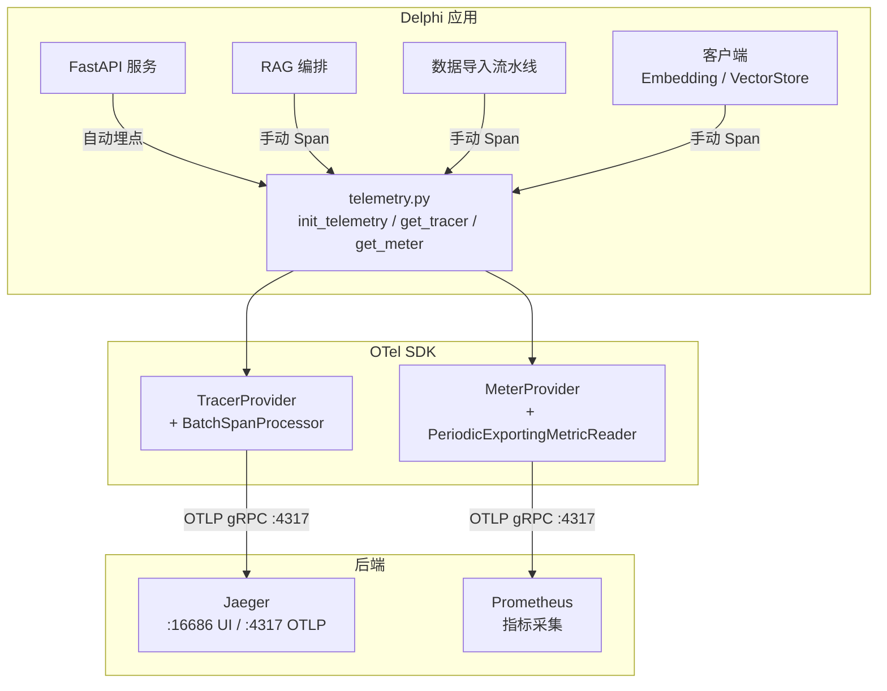
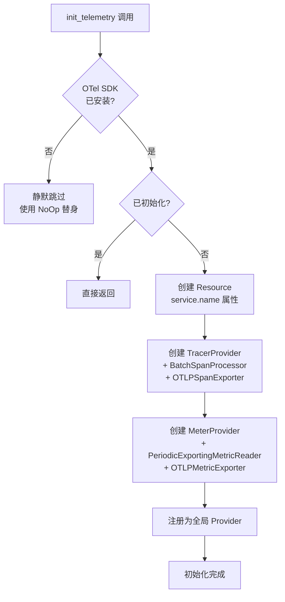

# 可观测性架构

## 概述

Delphi 基于 OpenTelemetry（OTel）构建了完整的可观测性体系，覆盖 Trace（链路追踪）和 Metrics（指标）两大信号。核心设计原则：

- **零侵入**：OTel 作为可选依赖，未安装时自动降级为 NoOp 空操作，业务代码无需条件判断
- **标准协议**：统一使用 OTLP gRPC 导出，兼容 Jaeger、Grafana Tempo、SigNoz 等主流后端
- **全链路覆盖**：从数据导入到 RAG 查询，关键路径均有 Span 埋点

核心实现位于 `src/delphi/core/telemetry.py`，约 100 行代码完成全部初始化与降级逻辑。

## 架构设计



### 数据流

1. 业务模块通过 `get_tracer(name)` 获取 Tracer 实例，使用 `start_as_current_span` 创建 Span
2. FastAPI 层由 `FastAPIInstrumentor` 自动生成 HTTP 请求/响应 Span
3. `BatchSpanProcessor` 异步批量将 Span 通过 OTLP gRPC 导出到后端
4. `PeriodicExportingMetricReader` 定期推送 Metrics 到后端

### 初始化流程



## NoOp 降级机制

Delphi 的 OTel 集成设计为完全可选，通过三层降级保证业务代码零影响：

| 场景 | 行为 |
|------|------|
| 未安装 `delphi[otel]` 依赖 | `get_tracer()` 返回 `_NoOpTracer`，所有 Span 操作为空函数 |
| 已安装但 `DELPHI_OTEL_ENABLED=false` | OTel SDK 已加载但未初始化 Provider，Span 不会被导出 |
| 已安装且启用，但后端不可达 | `BatchSpanProcessor` 异步导出，失败时静默丢弃，不阻塞业务 |

NoOp 替身类包括：

- `_NoOpSpan` — `set_attribute`、`set_status`、`record_exception`、`end` 均为空操作，支持 `with` 上下文管理器
- `_NoOpTracer` — `start_as_current_span` 返回 `_NoOpSpan`
- `_NoOpMeter` — `create_histogram` 和 `create_counter` 返回匿名空操作对象

业务代码无需任何条件判断，始终安全调用：

```python
from delphi.core.telemetry import get_tracer

_tracer = get_tracer(__name__)

# 无论 OTel 是否安装，以下代码均正常运行
with _tracer.start_as_current_span("my_operation") as span:
    span.set_attribute("key", "value")
    # 业务逻辑...
```

## Span 定义一览

### RAG 查询链路

一次 RAG 查询产生的 Span 层级：

```
rag.retrieve
├── rag.query_rewrite        (查询改写)
├── embedding.embed          (向量化)
├── vectorstore.search       (向量检索)
├── rag.rerank               (重排序)
└── rag.llm_call             (LLM 生成)
```

| Span 名称 | 所在模块 | 关键属性 | 说明 |
|-----------|---------|---------|------|
| `rag.retrieve` | `retrieval/rag.py` | `query`, `project`, `top_k`, `num_results`, `latency_ms` | 检索总入口 |
| `rag.query_rewrite` | `retrieval/rag.py` | `original_query`, `rewritten_query` | 查询改写 |
| `rag.rerank` | `retrieval/rag.py` | `num_candidates`, `num_results`, `latency_ms` | Reranker 精排 |
| `rag.llm_call` | `retrieval/rag.py` | `model`, `stream`, `latency_ms` | LLM 推理调用 |

### 数据导入链路

```
pipeline.git_clone
pipeline.parse_chunk
pipeline.embed_store
```

| Span 名称 | 所在模块 | 关键属性 | 说明 |
|-----------|---------|---------|------|
| `pipeline.git_clone` | `ingestion/pipeline.py` | `url`, `branch` | Git 仓库克隆 |
| `pipeline.embed_store` | `ingestion/pipeline.py` | `num_chunks`, `latency_s` | Embedding 生成与向量存储 |

### 客户端 Span

| Span 名称 | 所在模块 | 关键属性 | 说明 |
|-----------|---------|---------|------|
| `embedding.embed` | `core/clients.py` | `backend`, `num_texts`, `latency_ms` | Embedding 服务调用 |
| `vectorstore.search` | `core/clients.py` | `collection`, `top_k`, `num_results` | Qdrant 向量检索 |

### Span 属性详细说明

每个 Span 携带结构化属性，便于在追踪后端中过滤和分析：

| 属性 | 类型 | 示例值 | 说明 |
|------|------|--------|------|
| `rag.query` | string | `"如何注册组件？"` | 用户原始查询 |
| `rag.project` | string | `"apollo"` | 目标项目名 |
| `rag.top_k` | int | `5` | 请求的 Top-K |
| `rag.retrieve.latency_ms` | float | `342.15` | 检索总耗时（ms） |
| `rag.retrieve.num_results` | int | `5` | 最终返回的 Chunk 数 |
| `rag.rerank.num_candidates` | int | `15` | 进入 Reranker 的候选数 |
| `rag.rerank.num_results` | int | `5` | Reranker 输出数 |
| `rag.llm.model` | string | `"Qwen/Qwen3.5-27B"` | 使用的 LLM 模型 |
| `rag.llm.stream` | bool | `true` | 是否流式输出 |
| `rag.llm.latency_ms` | float | `1523.40` | LLM 调用耗时（ms） |
| `pipeline.url` | string | `"https://github.com/..."` | 仓库地址 |
| `pipeline.branch` | string | `"main"` | 克隆分支 |
| `pipeline.num_chunks` | int | `386` | 生成的 Chunk 总数 |
| `pipeline.embed_store.latency_s` | float | `12.35` | Embedding + 存储耗时（s） |
| `embedding.backend` | string | `"tei"` | Embedding 后端类型 |
| `embedding.num_texts` | int | `1` | 本次 Embedding 的文本数 |
| `vectorstore.collection` | string | `"apollo"` | Qdrant Collection 名 |
| `vectorstore.top_k` | int | `15` | 检索 Top-K |
| `vectorstore.num_results` | int | `15` | 返回结果数 |

## 配置方式

通过环境变量控制 OTel 行为，所有变量均以 `DELPHI_` 为前缀：

| 环境变量 | 默认值 | 说明 |
|---------|--------|------|
| `DELPHI_OTEL_ENABLED` | `false` | 是否启用 OpenTelemetry |
| `DELPHI_OTEL_ENDPOINT` | `http://localhost:4317` | OTLP gRPC 接收端地址 |
| `DELPHI_OTEL_SERVICE_NAME` | `delphi` | 上报的服务名称 |

在 `.env` 文件中配置：

```bash
DELPHI_OTEL_ENABLED=true
DELPHI_OTEL_ENDPOINT=http://jaeger:4317
DELPHI_OTEL_SERVICE_NAME=delphi
```

安装 OTel 可选依赖：

```bash
pip install delphi[otel]
```

该命令会安装以下包：

| 包名 | 用途 |
|------|------|
| `opentelemetry-api` | OTel API 接口 |
| `opentelemetry-sdk` | SDK 实现（TracerProvider / MeterProvider） |
| `opentelemetry-exporter-otlp` | OTLP gRPC 导出器 |
| `opentelemetry-instrumentation-fastapi` | FastAPI 自动埋点 |
| `opentelemetry-instrumentation-httpx` | httpx 请求自动埋点 |

## 与 Jaeger / Prometheus 集成

### 本地开发：Jaeger

`docker-compose.yml` 已内置 Jaeger 服务，通过 `otel` profile 按需启动：

```bash
# 启动 Jaeger + 核心服务
docker compose --profile otel up -d

# 启用 OTel
export DELPHI_OTEL_ENABLED=true
export DELPHI_OTEL_ENDPOINT=http://localhost:4317
```

Jaeger 暴露的端口：

| 端口 | 协议 | 用途 |
|------|------|------|
| `16686` | HTTP | Jaeger Web UI |
| `4317` | gRPC | OTLP gRPC 接收 |
| `4318` | HTTP | OTLP HTTP 接收 |

启动后访问 `http://localhost:16686` 打开 Jaeger UI，在 Service 下拉框中选择 `delphi` 即可查看链路。

### 查看 Trace

1. 打开 Jaeger UI → 选择 Service: `delphi`
2. 点击 **Find Traces**
3. 选择一条 Trace，展开查看各 Span 的耗时和属性

### 生产部署

Delphi 使用标准 OTLP gRPC 协议导出，兼容所有支持 OTLP 的后端：

```bash
# 导出到 Grafana Tempo
DELPHI_OTEL_ENDPOINT=http://tempo.internal:4317

# 导出到远程 Jaeger
DELPHI_OTEL_ENDPOINT=http://jaeger-collector.internal:4317

# 生产环境建议使用独立服务名
DELPHI_OTEL_SERVICE_NAME=delphi-prod
```

兼容后端列表：

- [Jaeger](https://www.jaegertracing.io/)
- [Grafana Tempo](https://grafana.com/oss/tempo/)
- [SigNoz](https://signoz.io/)
- [OpenTelemetry Collector](https://opentelemetry.io/docs/collector/)（可作为中间代理转发到任意后端）

### 链路示意图

以下展示一次 RAG 查询的完整 Trace 时序：

```mermaid
gantt
    title RAG 查询链路追踪
    dateFormat X
    axisFormat %s ms

    section 检索
    rag.retrieve           :0, 350
    embedding.embed        :10, 50
    vectorstore.search     :65, 55

    section 精排
    rag.rerank             :125, 80

    section 生成
    rag.llm_call           :230, 120
```



## 自定义 Span 指南

在 Delphi 中添加自定义 Span 只需三步：

### 1. 获取 Tracer

```python
from delphi.core.telemetry import get_tracer

_tracer = get_tracer(__name__)
```

### 2. 创建 Span

使用 `with` 语句创建 Span，自动管理生命周期：

```python
import time

def my_custom_operation(data: list[str]) -> list[str]:
    with _tracer.start_as_current_span("my_module.my_operation") as span:
        span.set_attribute("my_module.input_count", len(data))

        t0 = time.perf_counter()
        result = do_something(data)
        latency_ms = (time.perf_counter() - t0) * 1000

        span.set_attribute("my_module.output_count", len(result))
        span.set_attribute("my_module.latency_ms", round(latency_ms, 2))
        return result
```

### 3. Span 命名规范

遵循 `<模块>.<操作>` 的命名约定，与现有 Span 保持一致：

| 前缀 | 适用场景 | 示例 |
|------|---------|------|
| `rag.*` | RAG 查询链路 | `rag.retrieve`, `rag.rerank` |
| `pipeline.*` | 数据导入流水线 | `pipeline.git_clone` |
| `embedding.*` | Embedding 相关 | `embedding.embed` |
| `vectorstore.*` | 向量数据库操作 | `vectorstore.search` |

### 属性命名规范

- 使用点分隔的小写命名：`rag.retrieve.latency_ms`
- 耗时统一使用 `latency_ms`（毫秒）或 `latency_s`（秒）
- 数量统一使用 `num_*` 前缀：`num_results`, `num_chunks`

### 异常记录

Span 支持记录异常信息，便于在 Jaeger 中排查错误：

```python
with _tracer.start_as_current_span("my_module.risky_op") as span:
    try:
        result = risky_operation()
    except Exception as exc:
        span.record_exception(exc)
        span.set_status(StatusCode.ERROR, str(exc))
        raise
```

### 使用 Meter 记录指标

除 Trace 外，还可通过 `get_meter` 记录 Metrics：

```python
from delphi.core.telemetry import get_meter

_meter = get_meter(__name__)
_request_counter = _meter.create_counter("my_module.requests", description="请求总数")
_latency_hist = _meter.create_histogram("my_module.latency", description="请求耗时", unit="ms")

def handle_request():
    _request_counter.add(1)
    t0 = time.perf_counter()
    # ...
    _latency_hist.record((time.perf_counter() - t0) * 1000)
```
