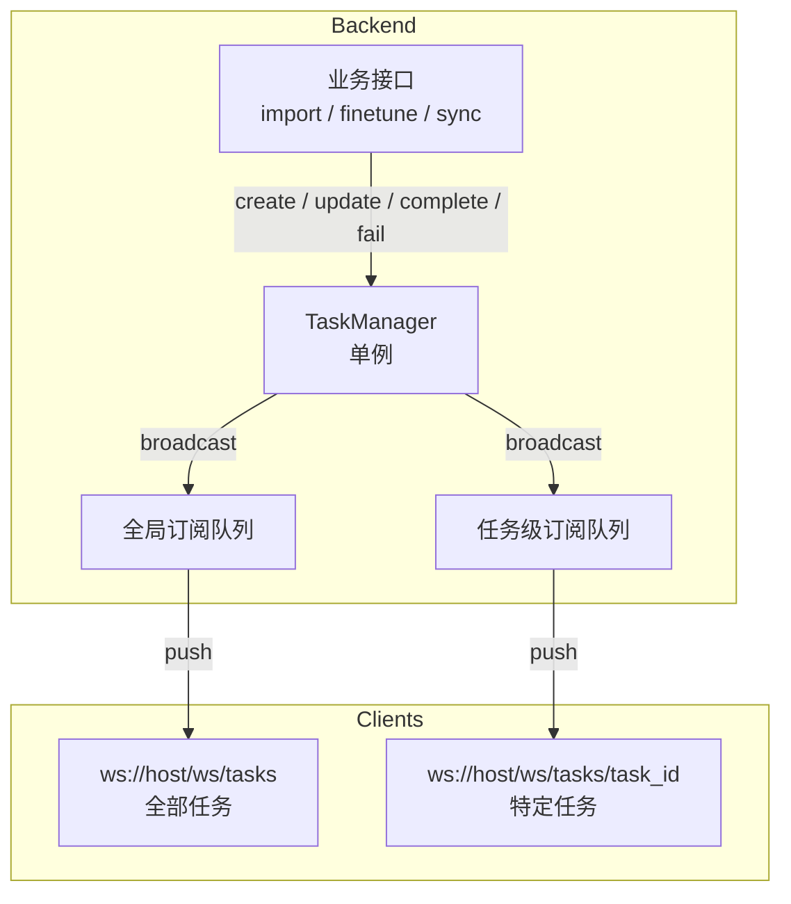
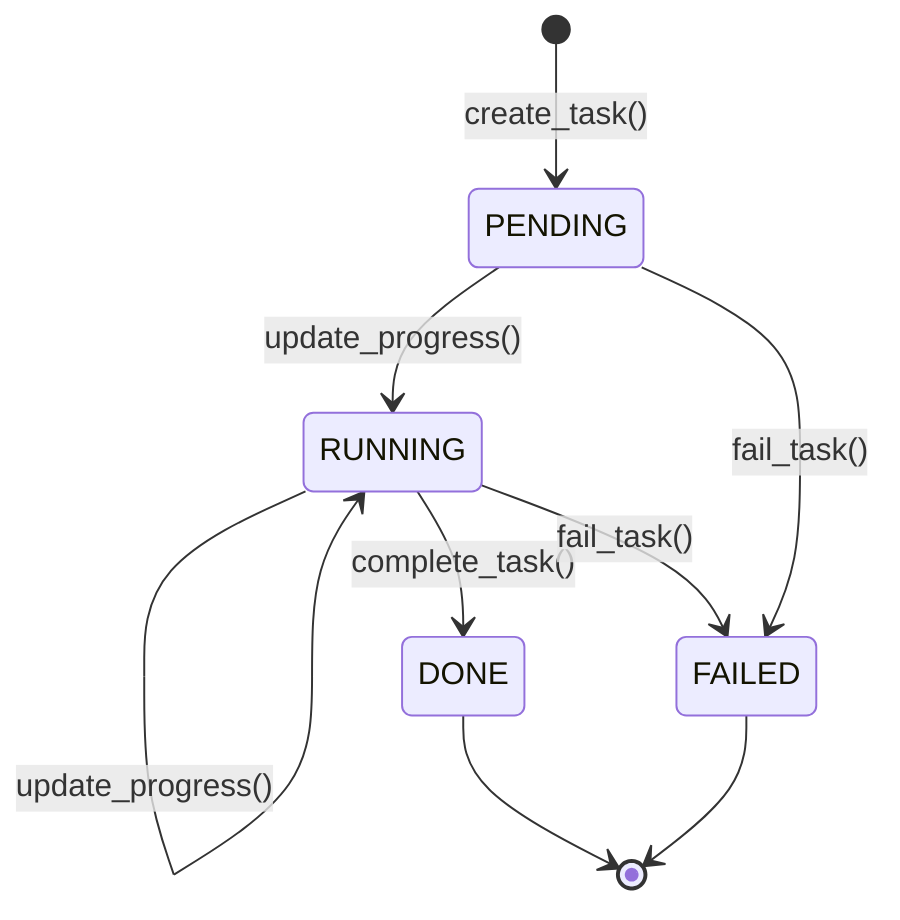
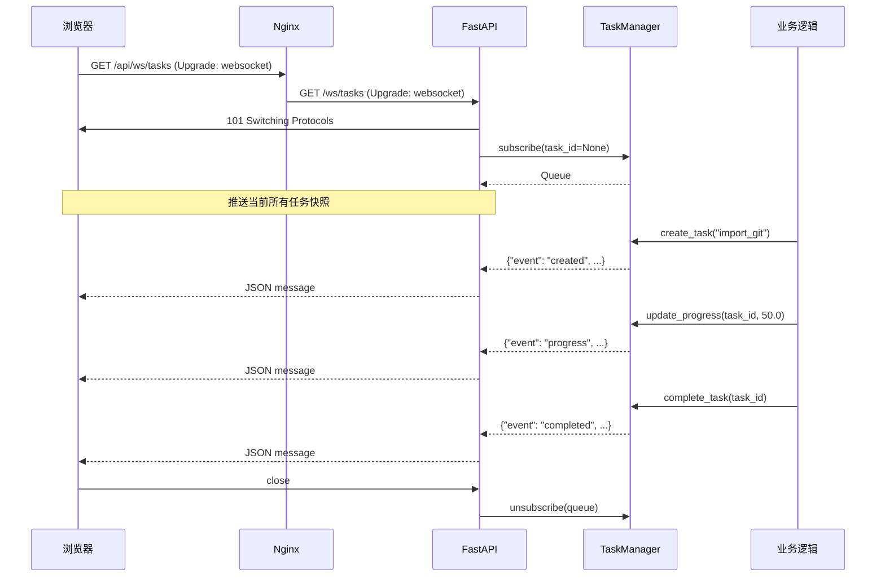

# WebSocket 实时推送

## 概述

Delphi 中的数据导入、向量化、微调等操作通常耗时较长（数分钟到数小时）。传统的轮询方式会带来不必要的网络开销和延迟，因此我们通过 WebSocket 实现服务端主动推送，让前端能够实时展示任务进度、状态变更和错误信息。

## 架构设计

核心由两个组件构成：

- **TaskRecord** — 单个任务的状态快照，包含进度、消息、元数据等字段
- **TaskManager** — 全局单例，负责任务生命周期管理和广播分发

### 广播机制

TaskManager 内部维护两级订阅队列：

- **全局订阅**（`_global_subscribers`）：接收所有任务的事件，用于任务列表页面
- **任务级订阅**（`_subscribers[task_id]`）：仅接收特定任务的事件，用于任务详情页面

每个 WebSocket 连接对应一个 `asyncio.Queue`（容量 256），TaskManager 通过 `put_nowait` 非阻塞写入，队列满时丢弃消息并记录警告日志。



## WebSocket 端点

### `ws://host/ws/tasks` — 订阅所有任务

连接建立后，服务端立即推送当前所有任务的快照（`event: snapshot`），随后持续推送增量事件。

适用场景：任务列表页面、全局进度面板。

### `ws://host/ws/tasks/{task_id}` — 订阅特定任务

连接建立后，若该任务存在则推送当前状态快照，随后仅推送该任务的事件。

适用场景：任务详情页面、导入进度弹窗。

## 消息格式

所有消息均为 JSON，包含 `event` 字段标识事件类型：

### 快照事件（连接时推送）

```json
{
  "event": "snapshot",
  "task_id": "a1b2c3d4e5f6",
  "task_type": "import_git",
  "status": "running",
  "progress": 45.2,
  "message": "正在处理 src/modules/planning ...",
  "metadata": {
    "project": "apollo",
    "total_files": 15000
  },
  "result": null,
  "error": null,
  "created_at": 1711526400.0,
  "updated_at": 1711526520.0
}
```

### 事件类型一览

| event | 触发时机 | 关键字段 |
|---|---|---|
| `created` | 任务创建 | `task_id`, `task_type`, `metadata` |
| `progress` | 进度更新 | `progress` (0-100), `message` |
| `completed` | 任务完成 | `result` |
| `failed` | 任务失败 | `error` |
| `snapshot` | WebSocket 连接建立 | 完整任务状态 |

### JSON Schema

```json
{
  "type": "object",
  "required": ["event", "task_id", "task_type", "status", "progress"],
  "properties": {
    "event": {
      "type": "string",
      "enum": ["created", "progress", "completed", "failed", "snapshot"]
    },
    "task_id": { "type": "string" },
    "task_type": { "type": "string" },
    "status": {
      "type": "string",
      "enum": ["pending", "running", "done", "failed"]
    },
    "progress": { "type": "number", "minimum": 0, "maximum": 100 },
    "message": { "type": "string" },
    "metadata": { "type": "object" },
    "result": { "type": ["object", "null"] },
    "error": { "type": ["string", "null"] },
    "created_at": { "type": "number" },
    "updated_at": { "type": "number" }
  }
}
```

## 任务生命周期



各状态说明：

| 状态 | 含义 | 触发方法 |
|---|---|---|
| `pending` | 任务已创建，等待执行 | `TaskManager.create_task()` |
| `running` | 任务执行中，进度持续更新 | `TaskManager.update_progress()` |
| `done` | 任务成功完成，`progress` 自动设为 100 | `TaskManager.complete_task()` |
| `failed` | 任务失败，`error` 字段包含错误信息 | `TaskManager.fail_task()` |

### 后端使用示例

```python
from delphi.api.websocket import task_manager

# 创建任务
task_id = task_manager.create_task(
    task_type="import_git",
    metadata={"project": "apollo", "url": "https://github.com/..."}
)

# 更新进度
task_manager.update_progress(task_id, progress=30.0, message="正在克隆仓库...")
task_manager.update_progress(task_id, progress=75.0, message="正在向量化...")

# 完成 / 失败
task_manager.complete_task(task_id, result={"chunks": 12000})
# 或
task_manager.fail_task(task_id, error="Git clone failed: timeout")
```

## 前端集成

项目提供了 `useTaskProgress` React hook，封装了 WebSocket 连接管理、自动重连和状态聚合。

### 基本用法

```tsx
import { useTaskProgress } from "@/hooks/useTaskProgress";

// 订阅所有任务
function TaskList() {
  const { tasks, connected } = useTaskProgress();

  return (
    <div>
      <span>{connected ? "已连接" : "连接中..."}</span>
      {Object.values(tasks).map((task) => (
        <div key={task.task_id}>
          {task.task_type} — {task.status} — {task.progress}%
          <p>{task.message}</p>
        </div>
      ))}
    </div>
  );
}

// 订阅特定任务
function TaskDetail({ taskId }: { taskId: string }) {
  const { tasks } = useTaskProgress({ taskId });
  const task = tasks[taskId];

  if (!task) return <div>等待任务数据...</div>;

  return (
    <div>
      <progress value={task.progress} max={100} />
      <p>{task.message}</p>
      {task.status === "failed" && <p className="error">{task.error}</p>}
    </div>
  );
}
```

### Hook 参数

| 参数 | 类型 | 默认值 | 说明 |
|---|---|---|---|
| `taskId` | `string` | — | 订阅特定任务，不传则订阅全部 |
| `enabled` | `boolean` | `true` | 是否自动连接 |
| `reconnectInterval` | `number` | `3000` | 断线重连间隔（ms） |

### 特性

- 自动适配 `ws://` / `wss://` 协议
- 断线自动重连，组件卸载时自动清理
- 通过 `Record<task_id, TaskProgress>` 聚合多任务状态

## Nginx 代理配置

WebSocket 需要 HTTP Upgrade 机制，Nginx 需要额外配置。当前配置位于 `web/nginx.conf`：

```nginx
# WebSocket proxy
location /api/ws/ {
    proxy_pass http://api:8888/ws/;
    proxy_http_version 1.1;
    proxy_set_header Upgrade $http_upgrade;
    proxy_set_header Connection "upgrade";
    proxy_set_header Host $host;
    proxy_set_header X-Real-IP $remote_addr;
    proxy_set_header X-Forwarded-For $proxy_add_x_forwarded_for;
    proxy_read_timeout 86400s;
    proxy_send_timeout 86400s;
}
```

关键配置说明：

- `proxy_http_version 1.1` — WebSocket 要求 HTTP/1.1
- `Upgrade` / `Connection` 头 — 触发协议升级
- `proxy_read_timeout 86400s` — 保持长连接 24 小时不超时
- 路径映射：前端通过 `/api/ws/tasks` 访问，Nginx 转发到后端 `/ws/tasks`

## 架构总览


