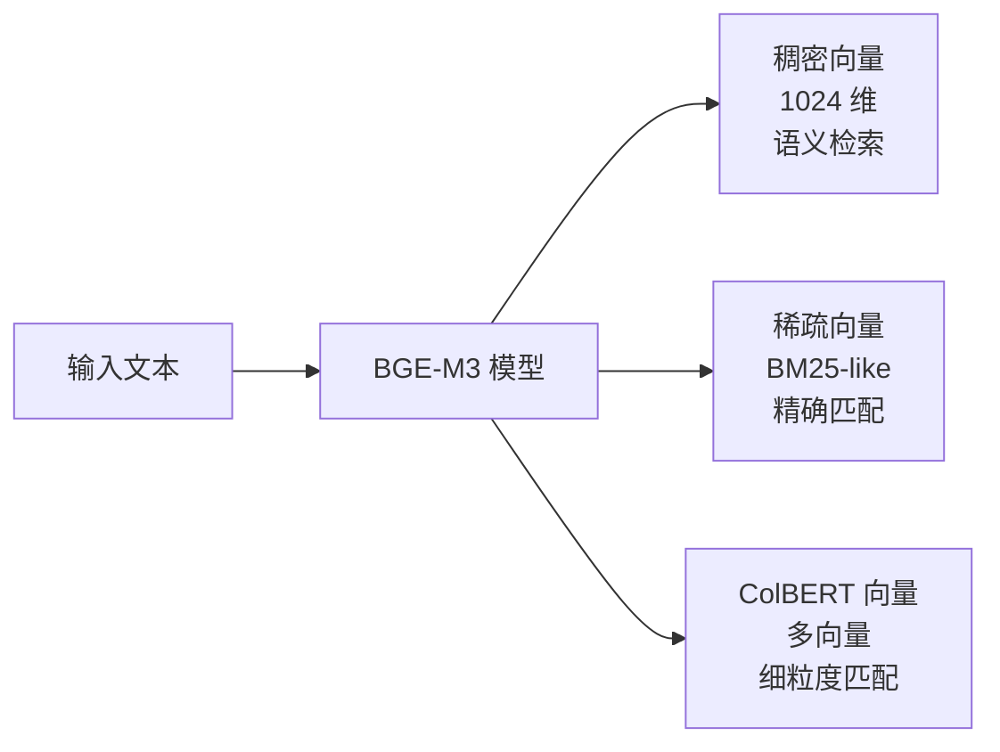

# 向量嵌入 (Embedding)

向量嵌入（Embedding）是将文本、图像或其他非结构化数据转换为数值向量的技术。它是现代语义搜索和 RAG 系统的基础——计算机通过比较向量之间的距离来判断两段文本的语义相似程度。

## 什么是嵌入？

直觉上，嵌入就是将语义"编码"到数字空间中。语义相近的文本，其向量在空间中的位置也相近。

```
"如何安装 Python？"    → [0.12, -0.34, 0.89, ...]  ←─ 距离近
"Python 安装教程"      → [0.15, -0.31, 0.91, ...]  ←─

"今天天气怎么样？"     → [-0.67, 0.23, -0.45, ...] ←─ 距离远
```

一个典型的嵌入向量有 768 到 4096 个维度。每个维度捕捉文本的某种语义特征，尽管这些特征通常没有人类可解释的含义。

## 文本如何变成向量

从原始文本到向量的过程分为三步：


### 第一步：分词（Tokenization）

将文本切分为模型能理解的最小单元（Token）：

```
"向量数据库" → ["向量", "数据", "库"]  （中文分词示例）
"vector db"  → ["vector", " db"]       （BPE 分词示例）
```

### 第二步：Transformer 编码

Token 序列经过多层 Transformer 注意力机制处理，每个 Token 都获得一个考虑了上下文的表示向量。

### 第三步：池化（Pooling）

将所有 Token 的向量聚合为一个固定长度的向量，常见方法：

- **[CLS] Token 池化**：取第一个特殊 Token 的向量（BERT 系列常用）
- **均值池化（Mean Pooling）**：对所有 Token 向量取平均（BGE 系列使用）

## 稠密嵌入 vs 稀疏嵌入

这是嵌入技术中最重要的区分之一，两者各有优势，Delphi 同时使用两者。

### 稠密嵌入（Dense Embedding）

向量的每个维度都有值，通常是浮点数。

```
"Python 列表推导式" → [0.23, -0.11, 0.87, 0.04, -0.56, ...]
                       ↑每个维度都有非零值，共 768/1024 维
```

**优势**：捕捉语义相似性，即使用词不同也能匹配
```
查询："如何遍历数组"
匹配："Python 列表迭代方法"  ✓ （语义相似，词汇不同）
```

**劣势**：对精确词汇匹配效果较差，计算成本高

### 稀疏嵌入（Sparse Embedding）

向量维度极高（通常 30000+），但绝大多数维度为零，只有出现的词汇对应的维度有值。

```
"Python 列表" → {词汇表索引 1234: 0.8, 词汇表索引 5678: 0.6, 其余: 0}
```

传统的 BM25 是稀疏检索的代表。现代稀疏嵌入（如 SPLADE）用神经网络学习词汇权重。

**优势**：精确词汇匹配，可解释性强，对专有名词（函数名、API 名）效果好
```
查询："torch.nn.functional.cross_entropy"
精确匹配："torch.nn.functional.cross_entropy 的用法"  ✓
```

**劣势**：无法捕捉语义相似性

### 对比总结

| 特性 | 稠密嵌入 | 稀疏嵌入 |
|------|----------|----------|
| 向量维度 | 768-4096 | 30000+ |
| 非零元素 | 全部 | 极少（< 1%） |
| 语义理解 | 强 | 弱 |
| 精确匹配 | 弱 | 强 |
| 存储开销 | 中等 | 低（稀疏存储） |
| 代码搜索 | 一般 | 好（函数名等） |

## 相似度度量

向量之间的相似度通过数学距离来衡量：

### 余弦相似度（Cosine Similarity）

衡量两个向量的方向夹角，与向量长度无关：

```
cos(θ) = (A · B) / (|A| × |B|)

范围：[-1, 1]，1 表示完全相同，0 表示无关，-1 表示相反
```

最常用的选择，对向量归一化不敏感。

### 点积（Dot Product）

```
A · B = Σ(Aᵢ × Bᵢ)
```

当向量已归一化时，等价于余弦相似度。OpenAI 的嵌入模型推荐使用点积。

### 欧氏距离（Euclidean Distance / L2）

```
d(A, B) = √(Σ(Aᵢ - Bᵢ)²)

距离越小，越相似
```

在某些场景下（如图像嵌入）效果更好，但对向量长度敏感。

### 如何选择？

```
已归一化的向量  → 余弦相似度 ≈ 点积（性能更好用点积）
未归一化的向量  → 余弦相似度（更稳定）
需要绝对距离    → 欧氏距离
```

BGE-M3 的向量已归一化，Delphi 使用余弦相似度。

## BGE-M3：稠密 + 稀疏双输出

BGE-M3 是 BAAI（北京智源人工智能研究院）发布的多功能嵌入模型，是 Delphi 的核心组件之一。

### 为什么选择 BGE-M3？

BGE-M3 的独特之处在于**单次推理同时输出稠密向量和稀疏向量**：



这使得一个模型就能支持三种检索模式，无需部署多个模型。

### 对代码搜索的意义

代码搜索是一个特殊场景，同时需要：

- **语义理解**：`list comprehension` 和 `列表推导式` 应该匹配
- **精确匹配**：`torch.optim.AdamW` 这样的函数名必须精确匹配

单纯的稠密检索会在精确函数名搜索上表现差，单纯的稀疏检索无法理解语义。BGE-M3 的双输出配合混合检索，完美解决了这个问题。

```
查询："AdamW 优化器的 weight_decay 参数"

稠密检索结果：关于优化器和权重衰减的语义相关文档
稀疏检索结果：包含 "AdamW" 和 "weight_decay" 字面量的文档

混合后：两者的并集，经 Reranker 重排序 → 最优结果
```

### 模型规格

| 参数 | 值 |
|------|----|
| 模型大小 | ~570MB |
| 最大输入长度 | 8192 tokens |
| 稠密向量维度 | 1024 |
| 支持语言 | 100+ 种（含中文、代码） |
| 许可证 | MIT |

## Delphi 如何使用嵌入

Delphi 在两个阶段使用 BGE-M3 嵌入：

**索引阶段**（离线）：
```
文档分块 → BGE-M3 → 稠密向量 + 稀疏向量 → 存入 Qdrant
```

**查询阶段**（在线）：
```
用户查询 → BGE-M3 → 稠密向量 + 稀疏向量 → 混合检索
```

两个阶段使用**同一个模型**，确保查询向量和文档向量在同一语义空间中，这是正确检索的前提。

Delphi 在本地运行 BGE-M3，通过 Ollama 或直接加载模型权重，所有嵌入计算均在用户设备上完成，无需调用外部 API。

## 延伸阅读

- [检索增强生成 (RAG)](./rag.md) — 嵌入在 RAG 中的作用
- [向量数据库](./vector-database.md) — 向量如何被存储和检索
- [重排序模型 (Reranker)](./reranker.md) — 检索之后的精排阶段
