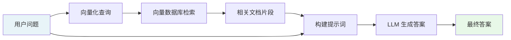
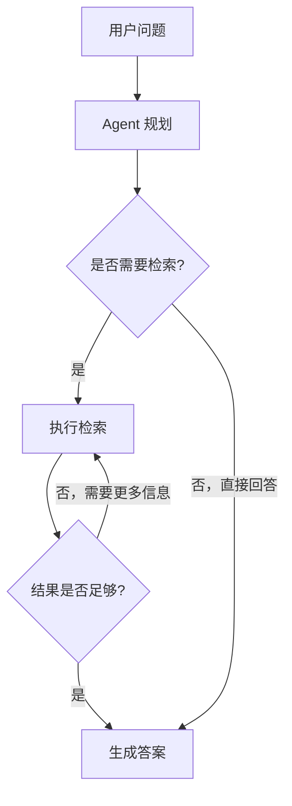
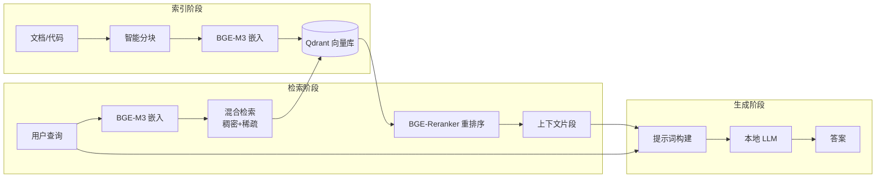

# 检索增强生成 (RAG)

检索增强生成（Retrieval-Augmented Generation，RAG）是一种将外部知识库与大语言模型（LLM）结合的技术架构，用于解决 LLM 在知识时效性和事实准确性方面的固有局限。

## 为什么需要 RAG？

### 大语言模型的两大痛点

**1. 知识截止日期（Knowledge Cutoff）**

LLM 的训练数据有固定的截止时间。GPT-4 的训练数据截止于 2023 年，这意味着它无法回答关于最新事件、最新代码库或最新文档的问题。对于企业内部知识库而言，这个问题更加突出——模型根本没有见过你的私有文档。

**2. 幻觉问题（Hallucination）**

LLM 有时会"编造"看似合理但实际错误的答案。当模型不确定某个事实时，它倾向于生成流畅但不准确的内容，而不是承认自己不知道。

```
用户：我们的 API 文档里 /api/v2/users 接口的参数是什么？
LLM（无 RAG）：该接口接受 name、email、role 三个参数... （可能是编造的）
LLM（有 RAG）：根据您的 API 文档第 23 页，该接口接受以下参数... （基于真实文档）
```

RAG 通过在生成答案前先检索相关文档，将"记忆"从模型权重中外化到可更新的知识库，从根本上解决了这两个问题。

## RAG 的工作原理

RAG 的核心流程分为三个阶段：**检索（Retrieve）→ 增强（Augment）→ 生成（Generate）**。



### 离线阶段：构建知识库

在用户提问之前，需要先将文档处理并存入向量数据库：

```
原始文档 → 文本分块 → 向量嵌入 → 存入向量数据库
```

1. **文档加载**：读取 PDF、Markdown、代码文件等各种格式
2. **文本分块**：将长文档切分为适合检索的小片段（通常 256-1024 tokens）
3. **向量嵌入**：用 Embedding 模型将文本转换为高维向量
4. **索引存储**：将向量和原始文本存入向量数据库

### 在线阶段：回答用户问题

```
用户问题 → 向量化 → 相似度检索 → 重排序 → 注入提示词 → LLM 生成
```

1. **查询向量化**：将用户问题转换为向量
2. **相似度检索**：在向量数据库中找到最相关的文档片段
3. **重排序**（可选）：用更精确的模型对检索结果重新排序
4. **提示词构建**：将检索到的文档片段和用户问题组合成提示词
5. **LLM 生成**：模型基于提供的上下文生成答案

## RAG 的三个发展阶段

### Naive RAG（基础 RAG）

最简单的实现：固定大小分块 → 单次向量检索 → 直接生成。

```
优点：实现简单，延迟低
缺点：检索质量有限，对复杂问题效果差
```

### Advanced RAG（高级 RAG）

在基础 RAG 上引入多种优化：

| 优化点 | 技术手段 |
|--------|----------|
| 更好的分块 | 语义分块、滑动窗口、父子分块 |
| 更好的检索 | 混合检索（向量 + 关键词）、多路召回 |
| 更好的排序 | Reranker 模型重排序 |
| 查询优化 | 查询改写、HyDE（假设文档嵌入） |

### Agentic RAG（智能体 RAG）

将 RAG 与 LLM Agent 结合，允许模型自主决定何时检索、检索什么、是否需要多轮检索：



Delphi 目前实现了 Advanced RAG，并在路线图中规划了 Agentic RAG 支持。

## 关键评估指标

评估 RAG 系统质量需要关注以下指标：

### 检索质量

- **召回率（Recall）**：相关文档中有多少被检索到了？召回率低意味着遗漏了重要信息。
- **精确率（Precision）**：检索到的文档中有多少是真正相关的？精确率低意味着引入了噪声。

```
召回率 = 检索到的相关文档数 / 总相关文档数
精确率 = 检索到的相关文档数 / 检索到的总文档数
```

### 生成质量

- **忠实度（Faithfulness）**：生成的答案是否忠实于检索到的上下文，没有编造内容？
- **答案相关性（Answer Relevancy）**：生成的答案是否真正回答了用户的问题？
- **上下文相关性（Context Relevancy）**：检索到的上下文是否与问题相关？

### 端到端指标

```
理想的 RAG 系统：高召回率 + 高精确率 + 高忠实度 + 高答案相关性
```

在实践中，召回率和精确率往往存在权衡：检索更多文档可以提高召回率，但会降低精确率并增加 LLM 的处理负担。Reranker 是解决这一矛盾的关键技术。

## Delphi 如何使用 RAG

Delphi 实现了一套完整的 Advanced RAG 流水线，专为代码和技术文档检索优化：



**Delphi 的核心设计选择：**

- 使用 **BGE-M3** 同时生成稠密向量和稀疏向量，实现混合检索，对代码搜索效果尤为突出
- 使用 **BGE-Reranker-v2-M3** 对初步检索结果重排序，显著提升精确率
- 使用 **Qdrant** 作为向量数据库，支持高效的混合检索和元数据过滤
- 所有组件均可**本地部署**，数据不离开用户环境

## 延伸阅读

- [向量嵌入 (Embedding)](./embedding.md) — 理解文本如何转换为向量
- [向量数据库](./vector-database.md) — 了解 Qdrant 的工作原理
- [重排序模型 (Reranker)](./reranker.md) — 深入了解重排序技术
