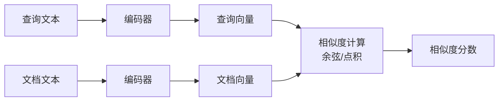
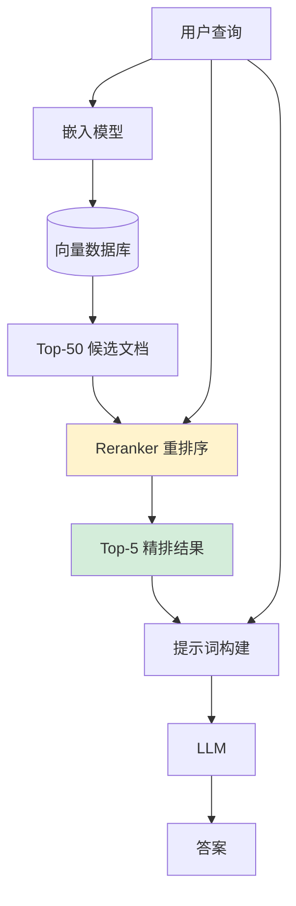
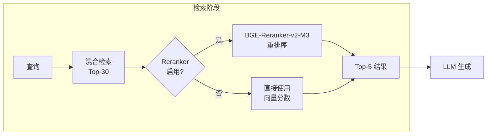

# 重排序模型 (Reranker)

重排序（Reranking）是 RAG 流水线中的精排阶段。初步检索（召回）负责快速找到候选文档，重排序负责从候选文档中精确筛选出最相关的结果。两者分工协作，共同保证检索质量。

## 为什么初步检索还不够？

### 召回率与精确率的矛盾

向量检索面临一个根本性的权衡：

- **要提高召回率**（不遗漏相关文档）→ 需要检索更多候选文档
- **要提高精确率**（减少无关文档）→ 需要更严格的筛选

如果只检索 Top-5，可能遗漏第 6 位的高度相关文档（召回率低）。
如果检索 Top-50，则会引入大量噪声，LLM 的上下文窗口被无关内容占满（精确率低）。

```
检索 Top-5：  [相关, 相关, 无关, 相关, 无关]  → 召回率低，可能遗漏
检索 Top-50： [相关, 相关, 无关, 无关, 无关, ...]  → 精确率低，噪声多
```

### 向量检索的局限性

嵌入向量是对文本语义的**压缩表示**，在压缩过程中不可避免地丢失了细节信息。两段文本的向量相似度高，并不意味着其中一段真的能回答另一段提出的问题。

```
查询："Python 中如何处理异常？"
文档 A："Python 异常处理机制详解（try/except/finally）"  ← 真正相关
文档 B："Python 是一种优雅的编程语言，异常处理是其特色之一"  ← 语义相似但不够有用

向量相似度：A ≈ B（都包含"Python"和"异常"的语义）
Reranker 评分：A >> B（A 直接回答了问题）
```

## 双编码器 vs 交叉编码器

理解 Reranker 的关键是理解这两种架构的区别。

### 双编码器（Bi-Encoder）

这是向量检索使用的架构。查询和文档**分别独立编码**，然后计算向量相似度：



**优势**：文档向量可以预计算并缓存，查询时只需编码查询，速度极快（毫秒级）
**劣势**：查询和文档之间没有直接的注意力交互，相关性判断不够精确

### 交叉编码器（Cross-Encoder）

这是 Reranker 使用的架构。查询和文档**拼接在一起**，让模型直接判断相关性：

```mermaid
flowchart LR
    Q[查询文本] --> CAT[拼接\n[CLS] 查询 [SEP] 文档 [SEP]]
    D[文档文本] --> CAT
    CAT --> M[Transformer 模型\n全注意力交互]
    M --> CLS[[CLS] 向量]
    CLS --> FC[分类头]
    FC --> S[相关性分数 0-1]
```

**优势**：查询和文档之间有完整的注意力交互，相关性判断精确
**劣势**：无法预计算，每次查询都需要对所有候选文档重新推理，速度慢（无法用于大规模初步检索）

### 在 RAG 中的分工

```
初步检索（双编码器）：快速从百万文档中召回 Top-50 候选
        ↓
重排序（交叉编码器）：精确对 50 个候选重新评分，取 Top-5
        ↓
LLM 生成：基于 5 个高质量上下文生成答案
```

这种"粗排 + 精排"的两阶段架构，在速度和精度之间取得了最佳平衡。

## 重排序在 RAG 流水线中的位置



重排序阶段接收两个输入：
1. 原始查询文本
2. 初步检索的候选文档列表

输出每个候选文档的相关性分数，然后按分数重新排序，取 Top-K 传给 LLM。

## BGE-Reranker-v2-M3

Delphi 使用 BAAI 发布的 BGE-Reranker-v2-M3 作为重排序模型。

### 模型特点

**多语言支持**：支持 100+ 种语言，中英文混合文档效果优秀，对代码注释中的中英文混合场景处理良好。

**轻量高效**：相比 v1 系列，v2-M3 在保持精度的同时显著降低了推理延迟，适合本地部署。

**与 BGE-M3 协同**：BGE-M3（嵌入）和 BGE-Reranker-v2-M3（重排序）来自同一系列，在语义空间上高度兼容，配合使用效果最佳。

### 模型规格

| 参数 | 值 |
|------|----|
| 模型大小 | ~570MB |
| 最大输入长度 | 8192 tokens（查询 + 文档） |
| 输出 | 相关性分数（0-1 浮点数） |
| 支持语言 | 100+ 种 |
| 许可证 | MIT |

### 使用示例

```python
from FlagEmbedding import FlagReranker

reranker = FlagReranker('BAAI/bge-reranker-v2-m3', use_fp16=True)

# 输入：查询 + 候选文档对
pairs = [
    ["如何处理 Python 异常？", "Python 异常处理机制详解（try/except/finally）"],
    ["如何处理 Python 异常？", "Python 是一种优雅的编程语言"],
    ["如何处理 Python 异常？", "try/except 块可以捕获并处理运行时错误"],
]

scores = reranker.compute_score(pairs)
# 输出：[0.92, 0.31, 0.88]
# 第一和第三个文档高度相关，第二个不相关
```

## 重排序前后的效果对比

以下是一个典型的重排序效果示例：

**查询**："Qdrant 如何配置持久化存储？"

**初步检索结果（向量相似度排序）**：

| 排名 | 文档摘要 | 向量相似度 |
|------|----------|------------|
| 1 | Qdrant 简介：一个高性能向量数据库 | 0.87 |
| 2 | Qdrant 持久化存储配置：设置 storage_path 参数... | 0.85 |
| 3 | 向量数据库的存储原理 | 0.83 |
| 4 | Qdrant Docker 部署指南 | 0.82 |
| 5 | Qdrant Python 客户端安装 | 0.81 |

**重排序后结果（Reranker 评分排序）**：

| 排名 | 文档摘要 | Reranker 分数 |
|------|----------|---------------|
| 1 | Qdrant 持久化存储配置：设置 storage_path 参数... | 0.96 |
| 2 | Qdrant Docker 部署指南 | 0.71 |
| 3 | Qdrant 简介：一个高性能向量数据库 | 0.43 |
| 4 | 向量数据库的存储原理 | 0.38 |
| 5 | Qdrant Python 客户端安装 | 0.22 |

重排序将真正回答问题的文档从第 2 位提升到第 1 位，并大幅拉开了相关文档和不相关文档之间的分数差距。

## 性能影响与权衡

### 延迟开销

Reranker 是 RAG 流水线中延迟最高的环节之一：

```
向量检索：~10ms（预计算向量，ANN 索引）
Reranker：~100-500ms（取决于候选数量和文档长度）
LLM 生成：~1000-5000ms
```

优化策略：
- **控制候选数量**：初步检索 Top-20 到 Top-50，而非 Top-100+
- **使用 FP16/INT8 量化**：减少推理时间约 50%
- **批处理**：将所有候选文档一次性送入 Reranker

### 质量提升

在典型的 RAG 评测中，加入 Reranker 后：

```
NDCG@5（归一化折损累积增益）：+15% ~ +25%
答案忠实度（Faithfulness）：+10% ~ +20%
答案相关性（Answer Relevancy）：+8% ~ +15%
```

对于代码搜索场景，提升幅度通常更大，因为代码文档中存在大量语义相似但实际用途不同的片段。

## Delphi 如何使用 Reranker

Delphi 将 Reranker 集成为可选的流水线组件，默认启用：



**配置示例**：

```yaml
# delphi.config.yaml
retrieval:
  top_k_candidates: 30    # 初步检索候选数量
  reranker:
    enabled: true
    model: "BAAI/bge-reranker-v2-m3"
    top_k_final: 5        # 重排序后保留数量
    use_fp16: true        # 使用半精度加速
```

Reranker 模型同样在本地运行，无需网络请求，保证数据隐私。

## 延伸阅读

- [检索增强生成 (RAG)](./rag.md) — Reranker 在完整 RAG 流水线中的位置
- [向量嵌入 (Embedding)](./embedding.md) — 初步检索阶段的技术基础
- [向量数据库](./vector-database.md) — 候选文档的来源
