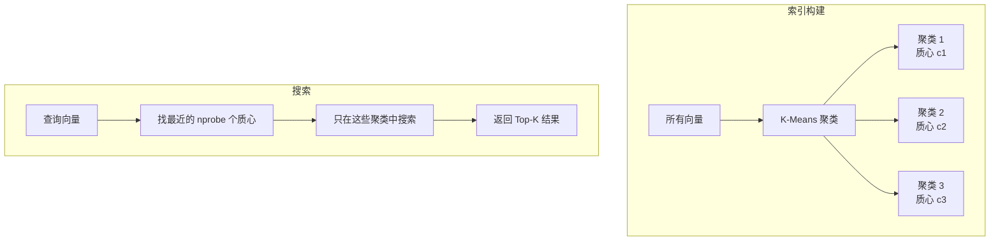
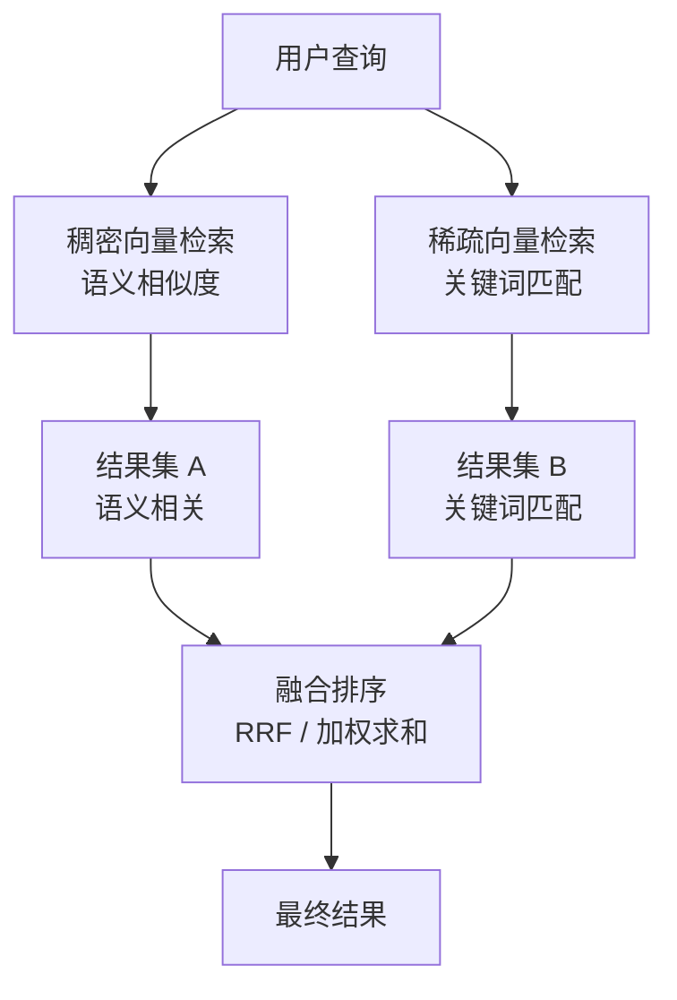

# 向量数据库

向量数据库是专门为存储和检索高维向量而设计的数据库系统。它是 RAG 系统的核心存储层，负责在毫秒级时间内从数百万个向量中找到最相似的结果。

## 向量数据库 vs 传统数据库

传统关系型数据库（如 PostgreSQL）擅长精确匹配和范围查询：

```sql
-- 传统数据库：精确匹配
SELECT * FROM docs WHERE title = 'Python 教程';
SELECT * FROM docs WHERE created_at > '2024-01-01';
```

向量数据库解决的是完全不同的问题——**近似最近邻搜索（ANN）**：

```
给定查询向量 q，找出数据库中与 q 最相似的 k 个向量
```

这个问题在高维空间中极具挑战性。暴力枚举（计算查询向量与所有存储向量的距离）在百万级数据量下延迟无法接受，因此需要专门的索引结构。

```
传统数据库：WHERE id = 42          → 精确查找，O(log n)
向量数据库：最相似的 10 个向量      → 近似搜索，需要特殊索引
```

## 核心索引类型

### Flat（暴力搜索）

最简单的方式：计算查询向量与所有向量的距离，返回最近的 k 个。

```
优点：100% 精确，无需训练
缺点：O(n) 复杂度，百万级数据下延迟数秒
适用：数据量 < 10 万，或需要精确结果的场景
```

### IVF（倒排文件索引）

将向量空间划分为若干个聚类（Voronoi 单元），搜索时只在最近的几个聚类中查找：



```
优点：搜索速度快，内存占用低
缺点：需要训练，nprobe 参数影响速度/精度权衡
适用：大规模数据集（百万级以上）
```

### HNSW（分层可导航小世界图）

目前最流行的 ANN 索引，基于图结构：

```
层 2（稀疏）：  1 ─────────── 5
层 1（中等）：  1 ── 3 ── 5 ── 7
层 0（密集）：  1─2─3─4─5─6─7─8─9
```

搜索从顶层（稀疏）开始，快速定位大致区域，然后逐层下降到底层（密集）进行精细搜索。

```
优点：搜索速度极快，精度高，支持动态插入
缺点：内存占用较高（需要存储图结构）
适用：大多数生产场景，Delphi 默认使用
```

### 性能对比

| 索引类型 | 搜索速度 | 精度 | 内存 | 构建时间 | 动态插入 |
|----------|----------|------|------|----------|----------|
| Flat | 慢 | 100% | 低 | 无 | 支持 |
| IVF | 快 | ~95% | 低 | 需要 | 有限 |
| HNSW | 极快 | ~99% | 高 | 快 | 支持 |

## 元数据过滤

向量数据库不只存储向量，还存储与向量关联的元数据（payload），支持在向量搜索的同时进行结构化过滤。

```json
{
  "vector": [0.12, -0.34, 0.89, ...],
  "payload": {
    "source": "docs/api/users.md",
    "file_type": "markdown",
    "language": "zh",
    "created_at": "2024-03-15",
    "tags": ["api", "users"]
  }
}
```

查询时可以组合向量相似度和元数据条件：

```python
# 只在 Markdown 文件中搜索，且创建时间在 2024 年之后
results = client.search(
    collection_name="docs",
    query_vector=query_embedding,
    query_filter=Filter(
        must=[
            FieldCondition(key="file_type", match=MatchValue(value="markdown")),
            FieldCondition(key="created_at", range=DatetimeRange(gte="2024-01-01"))
        ]
    ),
    limit=10
)
```

Delphi 利用元数据过滤支持按文件类型、项目、语言等维度限定搜索范围。

## 混合检索（Hybrid Search）

混合检索将向量搜索（语义）和关键词搜索（精确）结合，取两者之长：



### 结果融合：RRF（倒数排名融合）

RRF 是最常用的融合算法，不依赖分数的绝对值，只看排名：

```
RRF_score(d) = Σ 1 / (k + rank(d, list_i))

其中 k=60 是平滑参数，rank 是文档在各列表中的排名
```

```
文档 A：稠密排名第 2，稀疏排名第 1 → RRF = 1/62 + 1/61 ≈ 0.032
文档 B：稠密排名第 1，稀疏排名第 5 → RRF = 1/61 + 1/65 ≈ 0.032
文档 C：稠密排名第 3，稀疏排名第 2 → RRF = 1/63 + 1/62 ≈ 0.032
```

## 主流向量数据库对比

| 特性 | Qdrant | Milvus | ChromaDB | Pinecone |
|------|--------|--------|----------|----------|
| 部署方式 | 本地/云 | 本地/云 | 本地/云 | 仅云端 |
| 开源 | ✓ | ✓ | ✓ | ✗ |
| 混合检索 | ✓ 原生支持 | ✓ | 有限 | ✓ |
| 元数据过滤 | ✓ 强大 | ✓ | ✓ | ✓ |
| 稀疏向量 | ✓ 原生 | ✓ | ✗ | ✓ |
| 编程语言 | Rust | Go/C++ | Python | - |
| 内存效率 | 高 | 中 | 低 | - |
| 生产就绪 | ✓ | ✓ | 开发为主 | ✓ |
| 许可证 | Apache 2.0 | Apache 2.0 | Apache 2.0 | 商业 |

### ChromaDB

最易上手，纯 Python 实现，适合原型开发。但在大规模数据和生产环境下性能有限，不原生支持稀疏向量。

### Milvus

功能全面，适合超大规模（亿级）数据。架构复杂，依赖 etcd、MinIO 等组件，运维成本较高。

### Pinecone

全托管云服务，无需运维。但数据必须上传到云端，不适合私有化部署场景，且有使用成本。

### Qdrant

用 Rust 编写，性能优异，内存效率高。原生支持稀疏向量和混合检索，API 设计简洁，支持单文件本地部署（SQLite 模式）到分布式集群的全范围场景。

## Delphi 为什么选择 Qdrant

Delphi 选择 Qdrant 作为向量数据库，基于以下考量：

**1. 原生混合检索支持**

Qdrant 原生支持稠密向量和稀疏向量的混合检索，与 BGE-M3 的双输出完美配合，无需额外的融合层。

**2. 本地部署友好**

Qdrant 可以以单个二进制文件运行，也支持 Docker 一键启动，符合 Delphi "本地优先" 的设计原则。数据存储在本地磁盘，完全私有。

**3. 性能与资源效率**

Rust 实现带来了出色的内存效率和低延迟。在个人开发机上，Qdrant 的资源占用远低于 Milvus。

**4. 强大的元数据过滤**

Qdrant 的 payload 过滤功能强大且灵活，支持嵌套字段、数组包含、地理位置等多种条件，满足 Delphi 按文件类型、项目等维度过滤的需求。

**5. 活跃的开发和良好的 Python SDK**

Qdrant 的 Python 客户端设计良好，文档完善，社区活跃。

```python
# Delphi 中的典型 Qdrant 使用示例
from qdrant_client import QdrantClient
from qdrant_client.models import SparseVector, NamedSparseVector

client = QdrantClient(path="./qdrant_storage")  # 本地文件存储

# 混合检索：稠密 + 稀疏
results = client.query_points(
    collection_name="knowledge_base",
    prefetch=[
        Prefetch(query=dense_vector, using="dense", limit=20),
        Prefetch(query=SparseVector(...), using="sparse", limit=20),
    ],
    query=FusionQuery(fusion=Fusion.RRF),
    limit=10
)
```

## 延伸阅读

- [向量嵌入 (Embedding)](./embedding.md) — 向量是如何生成的
- [重排序模型 (Reranker)](./reranker.md) — 检索之后的精排
- [检索增强生成 (RAG)](./rag.md) — 向量数据库在 RAG 中的位置
