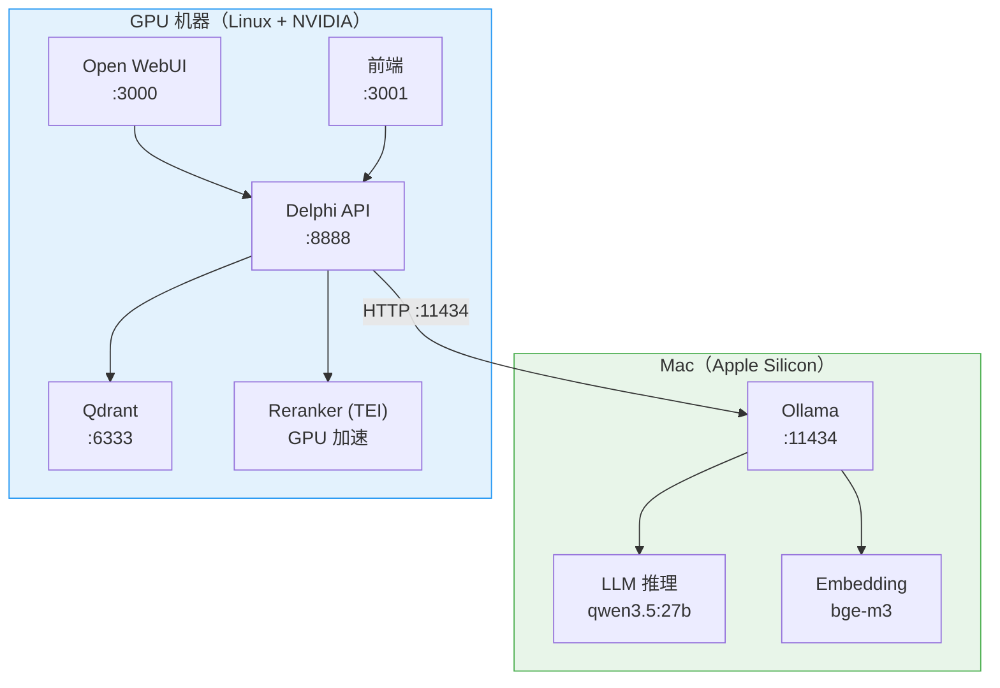

# 分布式部署

## 概述

在典型的个人开发场景中，你可能拥有一台 Mac（日常开发、写代码）和一台配备 GPU 的 Linux 机器（模型推理）。Delphi 支持将服务拆分到多台机器上运行，充分利用各自的硬件优势：

- **Mac**：运行 Ollama，提供 LLM 推理和 Embedding 服务（利用 Apple Silicon 的统一内存）
- **GPU 机器**：运行 Qdrant、Reranker、API 服务和 Web 前端（利用 NVIDIA GPU 加速 Reranker）

这种架构避免了在单台机器上堆叠所有服务，同时让 Mac 在日常开发之余也能贡献算力。

## 架构图



## 前置条件

### Mac 端

- macOS 13+ (Ventura) 且搭载 Apple Silicon (M1/M2/M3/M4)
- 安装 [Ollama](https://ollama.com/)（建议 v0.5+）
- 建议 16GB 以上统一内存（运行 27B 模型需要约 18GB）

### GPU 机器端

- Linux（推荐 Ubuntu 22.04+）
- Docker + Docker Compose v2
- NVIDIA GPU（建议 RTX 4060+ / 8GB+ 显存，Reranker 约需 1.1GB）
- NVIDIA Container Toolkit 已安装

### 网络

- 两台机器在同一局域网内
- Mac 的 11434 端口可被 GPU 机器访问

## 配置步骤

### 1. Mac 端配置

#### 安装并启动 Ollama

```bash
# 安装 Ollama（如果尚未安装）
brew install ollama

# 启动 Ollama 服务
ollama serve
```

#### 拉取所需模型

```bash
# LLM 模型
ollama pull qwen3.5:27b

# Embedding 模型
ollama pull bge-m3
```

#### 允许远程访问

Ollama 默认只监听 `127.0.0.1`，需要设置环境变量允许局域网访问：

```bash
# 方式一：临时设置
OLLAMA_HOST=0.0.0.0 ollama serve

# 方式二：写入 launchd 配置（永久生效）
launchctl setenv OLLAMA_HOST "0.0.0.0"
# 然后重启 Ollama
```

#### 确认 Mac 的局域网 IP

```bash
# 查看 Mac 的 IP 地址
ipconfig getifaddr en0
# 例如输出：192.168.1.100
```

### 2. GPU 机器端配置

#### 克隆项目并配置环境变量

```bash
cd /home/kent/Delphi

# 复制环境变量模板
cp .env.example .env
```

编辑 `.env`，添加分布式部署相关配置：

```bash
# Mac 局域网 IP（运行 Ollama 的机器）
MAC_IP=192.168.1.100

# Ollama 上的模型名（注意与 HuggingFace 名称不同）
DELPHI_LLM_MODEL=qwen3.5:27b
DELPHI_EMBEDDING_MODEL=bge-m3
DELPHI_EMBEDDING_BACKEND=ollama

# Reranker 仍使用本地 GPU
DELPHI_RERANKER_MODEL=BAAI/bge-reranker-v2-m3

# 可选：API 鉴权密钥
# DELPHI_API_KEY=your-secret-key
```

#### 使用分布式 Compose 文件启动

```bash
docker compose -f docker-compose.yml -f docker-compose.distributed.yml up -d
```

这条命令会：
- 用 busybox 占位替代 vllm 和 embedding 容器（它们由 Mac 上的 Ollama 提供）
- 保留 Qdrant、Reranker、API、WebUI 等服务在本机运行
- 将 API 服务的 LLM 和 Embedding 请求指向 Mac 上的 Ollama

### 3. 网络连通性检查

在 GPU 机器上验证能否访问 Mac 的 Ollama：

```bash
# 测试 Ollama 是否可达
curl http://192.168.1.100:11434/api/tags

# 测试 LLM 推理
curl http://192.168.1.100:11434/api/generate -d '{
  "model": "qwen3.5:27b",
  "prompt": "你好",
  "stream": false
}'

# 测试 Embedding
curl http://192.168.1.100:11434/api/embed -d '{
  "model": "bge-m3",
  "input": ["测试文本"]
}'
```

如果返回正常结果，说明网络连通性没有问题。

## 环境变量说明

| 变量 | 说明 | 默认值 |
|------|------|--------|
| `MAC_IP` | Mac 的局域网 IP | `host.docker.internal` |
| `DELPHI_LLM_MODEL` | Ollama 上的 LLM 模型名 | `qwen3.5:27b` |
| `DELPHI_EMBEDDING_MODEL` | Ollama 上的 Embedding 模型名 | `bge-m3` |
| `DELPHI_EMBEDDING_BACKEND` | Embedding 后端类型 | `ollama` |
| `DELPHI_RERANKER_MODEL` | Reranker 模型（本地 GPU） | `BAAI/bge-reranker-v2-m3` |
| `DELPHI_API_KEY` | API 鉴权密钥 | 空（不鉴权） |

分布式模式下，`docker-compose.distributed.yml` 会自动设置以下内部变量：

| 内部变量 | 值 |
|----------|-----|
| `DELPHI_VLLM_URL` | `http://${MAC_IP}:11434` |
| `DELPHI_EMBEDDING_URL` | `http://${MAC_IP}:11434` |
| `DELPHI_QDRANT_URL` | `http://qdrant:6333` |
| `DELPHI_RERANKER_URL` | `http://reranker:80` |

## 外部 LLM API 支持

如果不想在 Mac 上跑本地模型，也可以使用 DeepSeek、OpenAI 等兼容 API 作为 LLM 后端。

### DeepSeek

```bash
# .env
DELPHI_VLLM_URL=https://api.deepseek.com
DELPHI_LLM_API_KEY=sk-xxx
DELPHI_LLM_MODEL=deepseek-chat
```

### OpenAI 兼容服务

任何兼容 OpenAI `/v1/chat/completions` 接口的服务均可使用：

```bash
# .env
DELPHI_VLLM_URL=https://api.your-provider.com
DELPHI_LLM_API_KEY=sk-xxx
DELPHI_LLM_MODEL=your-model-name
```

### 云端 Embedding

Embedding 同样支持外部 API：

```bash
# OpenAI 兼容（DeepSeek / Together / Fireworks 等）
DELPHI_EMBEDDING_BACKEND=openai
DELPHI_EMBEDDING_URL=https://api.together.xyz
DELPHI_EMBEDDING_MODEL=BAAI/bge-m3
DELPHI_EMBEDDING_API_KEY=sk-xxx

# Cloudflare Workers AI
DELPHI_EMBEDDING_BACKEND=cloudflare
DELPHI_EMBEDDING_URL=https://api.cloudflare.com/client/v4/accounts/YOUR_ACCOUNT_ID/ai/run/@cf/baai/bge-m3
DELPHI_EMBEDDING_API_KEY=your-cf-token
```

::: tip
使用外部 API 时，分布式 Compose 文件中的 Ollama 相关配置会被 `.env` 中的值覆盖。你可以混合使用——例如 LLM 走 DeepSeek API，Embedding 走本地 Ollama。
:::

## docker-compose.distributed.yml 使用说明

分布式 Compose 文件采用 [Docker Compose 多文件覆盖](https://docs.docker.com/compose/how-tos/multiple-compose-files/merge/) 机制，在基础 `docker-compose.yml` 之上做增量修改：

```bash
# 标准启动命令
MAC_IP=192.168.1.100 docker compose \
  -f docker-compose.yml \
  -f docker-compose.distributed.yml \
  up -d

# 查看日志
docker compose \
  -f docker-compose.yml \
  -f docker-compose.distributed.yml \
  logs -f api

# 停止所有服务
docker compose \
  -f docker-compose.yml \
  -f docker-compose.distributed.yml \
  down
```

### 覆盖逻辑

| 服务 | 基础配置 | 分布式覆盖 |
|------|---------|-----------|
| `vllm` | vLLM GPU 推理 | 替换为 busybox 占位（由 Ollama 替代） |
| `embedding` | TEI GPU 推理 | 替换为 busybox 占位（由 Ollama 替代） |
| `reranker` | TEI GPU 推理 | 保持不变，继续使用本地 GPU |
| `qdrant` | 向量数据库 | 保持不变 |
| `api` | RAG API 服务 | 环境变量指向 Mac 上的 Ollama |
| `webui` | Open WebUI | 保持不变 |

### 简化命令

可以在 `.env` 中设置 `COMPOSE_FILE` 避免每次手动指定：

```bash
# .env
COMPOSE_FILE=docker-compose.yml:docker-compose.distributed.yml
MAC_IP=192.168.1.100
```

之后直接使用：

```bash
docker compose up -d
docker compose logs -f
docker compose down
```

## 常见问题排查

### API 服务启动后无法连接 Ollama

**现象**：API 日志报 `Connection refused` 或 `timeout`。

**排查步骤**：

1. 确认 Mac 上 Ollama 正在运行：`curl http://localhost:11434/api/tags`
2. 确认 Ollama 监听了 `0.0.0.0`（而非 `127.0.0.1`）：
   ```bash
   # Mac 上执行
   lsof -i :11434
   # 应看到 LISTEN 在 *:11434 而非 127.0.0.1:11434
   ```
3. 确认 GPU 机器能 ping 通 Mac：`ping 192.168.1.100`
4. 确认防火墙未阻止 11434 端口

### Embedding 返回空结果

**现象**：查询时返回 0 条结果，但数据已导入。

**排查**：

- 确认 `DELPHI_EMBEDDING_BACKEND=ollama` 已设置
- 确认 Ollama 上已拉取 `bge-m3` 模型：`ollama list`
- 注意：Ollama 后端不支持稀疏向量（sparse embedding），混合检索会自动退化为纯 dense 检索

### Reranker 服务启动失败

**现象**：`reranker` 容器反复重启。

**排查**：

- 确认 NVIDIA 驱动和 Container Toolkit 已正确安装：`nvidia-smi`
- Reranker 约需 1.1GB 显存，确认 GPU 有足够空间
- 查看容器日志：`docker compose logs reranker`

### 模型名称不匹配

Ollama 的模型名与 HuggingFace 不同：

| 用途 | HuggingFace 名称 | Ollama 名称 |
|------|------------------|-------------|
| LLM | `Qwen/Qwen3.5-27B` | `qwen3.5:27b` |
| Embedding | `BAAI/bge-m3` | `bge-m3` |

确保 `.env` 中使用的是 Ollama 格式的模型名。

### Docker 容器内无法解析 Mac IP

如果使用 `host.docker.internal` 作为默认值但无法解析：

```bash
# 显式指定 MAC_IP 而非依赖 host.docker.internal
MAC_IP=192.168.1.100 docker compose \
  -f docker-compose.yml \
  -f docker-compose.distributed.yml \
  up -d
```

`host.docker.internal` 仅在 Docker Desktop（macOS/Windows）上默认可用，Linux 上需要手动配置或直接使用 IP。
