# 可观测性与链路追踪

## 为什么需要可观测性

RAG 系统的一次查询涉及多个异步步骤：向量检索、重排序、Prompt 构建、LLM 调用……当响应变慢或结果不理想时，仅靠日志很难定位瓶颈。

OpenTelemetry（OTel）为 Delphi 提供了分布式链路追踪能力：

- 每次请求生成完整的 Trace，包含各阶段耗时与属性
- 可视化调用链路，快速定位慢查询和异常
- 支持导出到 Jaeger、Grafana Tempo 等主流后端
- 零侵入：未安装 OTel 依赖时自动降级为 NoOp，不影响正常运行

## 安装

OTel 作为可选依赖提供，按需安装：

```bash
pip install delphi[otel]
```

该命令会安装以下包：

| 包名 | 用途 |
|------|------|
| `opentelemetry-api` | OTel API 接口 |
| `opentelemetry-sdk` | SDK 实现（TracerProvider / MeterProvider） |
| `opentelemetry-exporter-otlp` | OTLP gRPC 导出器 |
| `opentelemetry-instrumentation-fastapi` | FastAPI 自动埋点 |
| `opentelemetry-instrumentation-httpx` | httpx 请求自动埋点 |

## 配置项

通过环境变量控制 OTel 行为，所有变量均以 `DELPHI_` 为前缀：

| 环境变量 | 默认值 | 说明 |
|---------|--------|------|
| `DELPHI_OTEL_ENABLED` | `false` | 是否启用 OpenTelemetry |
| `DELPHI_OTEL_ENDPOINT` | `http://localhost:4317` | OTLP gRPC 接收端地址 |
| `DELPHI_OTEL_SERVICE_NAME` | `delphi` | 上报的服务名称 |

在 `.env` 文件中配置示例：

```bash
DELPHI_OTEL_ENABLED=true
DELPHI_OTEL_ENDPOINT=http://jaeger:4317
DELPHI_OTEL_SERVICE_NAME=delphi
```

## 链路追踪 Span 清单

Delphi 在关键路径上手动埋点，形成完整的调用链路。

### RAG 查询链路

一次 RAG 查询产生的 Span 层级：

```
rag.retrieve
├── rag.vector_search
│   ├── embedding.embed        (EmbeddingClient)
│   └── vectorstore.search     (VectorStore)
├── rag.rerank
├── rag.prompt_build
└── rag.llm_call
```

| Span 名称 | 所在模块 | 说明 |
|-----------|---------|------|
| `rag.retrieve` | `retrieval/rag.py` | 检索总入口，记录查询、项目、耗时 |
| `rag.vector_search` | `retrieval/rag.py` | 向量检索阶段 |
| `rag.rerank` | `retrieval/rag.py` | Reranker 精排阶段 |
| `rag.prompt_build` | `retrieval/rag.py` | Prompt 组装阶段 |
| `rag.llm_call` | `retrieval/rag.py` | LLM 推理调用（流式/非流式） |

### 数据导入链路

```
pipeline.git_clone
pipeline.parse_chunk
pipeline.embed_store
```

| Span 名称 | 所在模块 | 说明 |
|-----------|---------|------|
| `pipeline.git_clone` | `ingestion/pipeline.py` | Git 仓库克隆 |
| `pipeline.parse_chunk` | `ingestion/pipeline.py` | 文件解析与分块 |
| `pipeline.embed_store` | `ingestion/pipeline.py` | Embedding 生成与向量存储 |

### 客户端 Span

| Span 名称 | 所在模块 | 说明 |
|-----------|---------|------|
| `embedding.embed` | `core/clients.py` | Embedding 服务调用 |
| `vectorstore.search` | `core/clients.py` | Qdrant 向量检索 |

## Span 属性说明

每个 Span 携带结构化属性，便于在追踪后端中过滤和分析：

### RAG 链路属性

| 属性 | 类型 | 示例值 | 说明 |
|------|------|--------|------|
| `rag.query` | string | `"如何注册组件？"` | 用户原始查询 |
| `rag.project` | string | `"apollo"` | 目标项目名 |
| `rag.top_k` | int | `5` | 请求的 Top-K |
| `rag.retrieve.latency_ms` | float | `342.15` | 检索总耗时（ms） |
| `rag.retrieve.num_results` | int | `5` | 最终返回的 Chunk 数 |
| `rag.vector_search.num_results` | int | `15` | 向量检索召回数 |
| `rag.rerank.input_count` | int | `15` | 进入 Reranker 的 Chunk 数 |
| `rag.rerank.output_count` | int | `5` | Reranker 输出的 Chunk 数 |
| `rag.prompt_build.num_chunks` | int | `5` | 构建 Prompt 使用的 Chunk 数 |
| `rag.prompt_build.intent` | string | `"code_explain"` | 意图分类结果 |
| `rag.llm.model` | string | `"Qwen/Qwen3.5-27B"` | 使用的 LLM 模型 |
| `rag.llm.stream` | bool | `true` | 是否流式输出 |
| `rag.llm.latency_ms` | float | `1523.40` | LLM 调用耗时（ms） |

### 导入链路属性

| 属性 | 类型 | 示例值 | 说明 |
|------|------|--------|------|
| `pipeline.url` | string | `"https://github.com/..."` | 仓库地址 |
| `pipeline.branch` | string | `"main"` | 克隆分支 |
| `pipeline.num_changed_files` | int | `42` | 变更文件数 |
| `pipeline.num_chunks` | int | `386` | 生成的 Chunk 总数 |
| `pipeline.embed_store.latency_s` | float | `12.35` | Embedding + 存储耗时（s） |

### 客户端属性

| 属性 | 类型 | 示例值 | 说明 |
|------|------|--------|------|
| `embedding.backend` | string | `"tei"` | Embedding 后端类型 |
| `embedding.num_texts` | int | `1` | 本次 Embedding 的文本数 |
| `vectorstore.collection` | string | `"apollo"` | Qdrant Collection 名 |
| `vectorstore.top_k` | int | `15` | 检索 Top-K |
| `vectorstore.hybrid` | bool | `true` | 是否混合检索 |
| `vectorstore.num_results` | int | `15` | 返回结果数 |

## 本地开发：使用 Jaeger

`docker-compose.yml` 已内置 Jaeger 服务，通过 `otel` profile 按需启动：

```bash
# 启动 Jaeger + 核心服务
docker compose --profile otel up -d

# 启用 OTel
export DELPHI_OTEL_ENABLED=true
export DELPHI_OTEL_ENDPOINT=http://localhost:4317
```

Jaeger 暴露的端口：

| 端口 | 协议 | 用途 |
|------|------|------|
| `16686` | HTTP | Jaeger Web UI |
| `4317` | gRPC | OTLP gRPC 接收 |
| `4318` | HTTP | OTLP HTTP 接收 |

启动后访问 [http://localhost:16686](http://localhost:16686) 打开 Jaeger UI，在 Service 下拉框中选择 `delphi` 即可查看链路。

### 查看 Trace 示例

1. 打开 Jaeger UI → 选择 Service: `delphi`
2. 点击 **Find Traces**
3. 选择一条 Trace，展开查看各 Span 的耗时和属性

## 生产部署

### 导出到 Grafana Tempo

```bash
DELPHI_OTEL_ENABLED=true
DELPHI_OTEL_ENDPOINT=http://tempo.internal:4317
DELPHI_OTEL_SERVICE_NAME=delphi-prod
```

### 导出到远程 Jaeger

```bash
DELPHI_OTEL_ENABLED=true
DELPHI_OTEL_ENDPOINT=http://jaeger-collector.internal:4317
DELPHI_OTEL_SERVICE_NAME=delphi-prod
```

Delphi 使用标准 OTLP gRPC 协议导出，兼容所有支持 OTLP 的后端：

- [Grafana Tempo](https://grafana.com/oss/tempo/)
- [Jaeger](https://www.jaegertracing.io/)
- [SigNoz](https://signoz.io/)
- [OpenTelemetry Collector](https://opentelemetry.io/docs/collector/)（可作为中间代理转发到任意后端）

## 优雅降级

Delphi 的 OTel 集成设计为完全可选：

| 场景 | 行为 |
|------|------|
| 未安装 `delphi[otel]` 依赖 | `get_tracer()` 返回 `_NoOpTracer`，所有 `start_as_current_span` 调用返回 `_NoOpSpan`，`set_attribute` 等方法为空操作 |
| 已安装但 `DELPHI_OTEL_ENABLED=false` | OTel SDK 已加载但未初始化 Provider，Span 不会被导出 |
| 已安装且启用，但后端不可达 | `BatchSpanProcessor` 异步导出，失败时静默丢弃，不阻塞业务请求 |

核心实现位于 `src/delphi/core/telemetry.py`：

```python
# 未安装 OTel 时的 NoOp 替身
class _NoOpSpan:
    def set_attribute(self, key: str, value: Any) -> None: ...
    def set_status(self, *args, **kwargs) -> None: ...
    def __enter__(self): return self
    def __exit__(self, *args): ...

class _NoOpTracer:
    def start_as_current_span(self, name: str, **kwargs):
        return _NoOpSpan()

def get_tracer(name: str):
    if _HAS_OTEL:
        return trace.get_tracer(name)
    return _NoOpTracer()
```

这意味着业务代码中的 `with _tracer.start_as_current_span("...")` 无需任何条件判断，始终安全调用。

## 链路示意图

以下 Mermaid 图展示一次 RAG 查询的完整 Trace 结构：

```mermaid
gantt
    title RAG 查询链路追踪
    dateFormat X
    axisFormat %s ms

    section 检索
    rag.retrieve           :0, 350
    rag.vector_search      :5, 120
    embedding.embed        :10, 50
    vectorstore.search     :65, 55

    section 精排
    rag.rerank             :125, 80

    section 生成
    rag.prompt_build       :210, 15
    rag.llm_call           :230, 120
```



数据导入链路：

```mermaid
gantt
    title 数据导入链路追踪
    dateFormat X
    axisFormat %s s

    section 导入
    pipeline.git_clone     :0, 5
    pipeline.parse_chunk   :5, 15
    pipeline.embed_store   :20, 30
```


