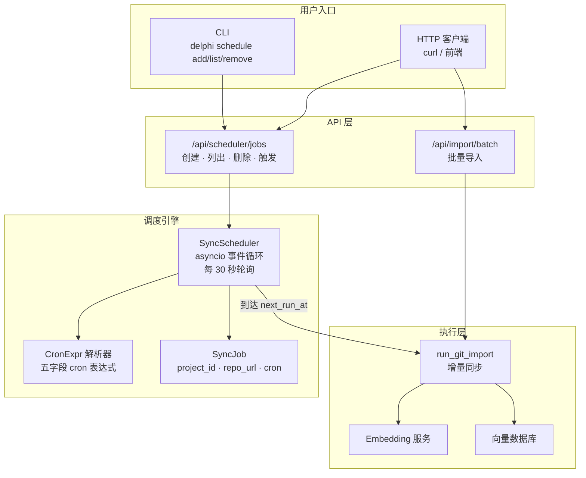

# 定时同步与批量导入

Delphi 内置轻量级定时同步调度器，基于 asyncio 实现，无需依赖 APScheduler 等第三方库。配合批量导入接口，可以自动化管理多个知识库的持续更新。

## 批量导入

当需要一次性导入多个 Git 仓库时，使用批量导入接口可以并发执行，避免逐个调用。

### API 端点

```
POST /api/import/batch
```

### 请求格式

| 字段 | 类型 | 必填 | 默认值 | 说明 |
|------|------|------|--------|------|
| `repos` | `BatchRepoItem[]` | 是 | - | 仓库列表 |
| `repos[].url` | `string` | 是 | - | Git 仓库地址 |
| `repos[].branch` | `string` | 否 | `"main"` | 分支名称 |
| `repos[].project_name` | `string` | 是 | - | 项目 ID |
| `depth` | `int` | 否 | `1` | Git clone 深度 |
| `include` | `string[]` | 否 | `[]` | 包含的文件 glob 模式 |
| `exclude` | `string[]` | 否 | `[]` | 排除的文件 glob 模式 |

### 请求示例

```json
{
  "repos": [
    {
      "url": "https://github.com/example/backend.git",
      "branch": "main",
      "project_name": "backend"
    },
    {
      "url": "https://github.com/example/frontend.git",
      "branch": "develop",
      "project_name": "frontend"
    }
  ],
  "depth": 1,
  "include": ["*.py", "*.ts"],
  "exclude": ["*_test.py", "*.spec.ts"]
}
```

### 响应示例

返回状态码 `202 Accepted`，每个仓库对应一个异步任务：

```json
{
  "tasks": [
    { "task_id": "a1b2c3d4", "status": "pending" },
    { "task_id": "e5f6g7h8", "status": "pending" }
  ]
}
```

通过 `GET /api/import/tasks/{task_id}` 查询各任务的执行状态。

## 定时同步

### Cron 表达式语法

调度器使用标准五字段 cron 表达式：

```
┌───────────── 分钟 (0-59)
│ ┌───────────── 小时 (0-23)
│ │ ┌───────────── 日 (1-31)
│ │ │ ┌───────────── 月 (1-12)
│ │ │ │ ┌───────────── 星期 (0-6，0=周一)
│ │ │ │ │
* * * * *
```

支持的语法：

| 语法 | 说明 | 示例 |
|------|------|------|
| `数字` | 精确匹配 | `5` — 第 5 分钟 |
| `*` | 通配符，匹配所有值 | `*` — 每分钟 |
| `*/n` | 步长 | `*/6` — 每 6 个单位 |
| `a-b` | 范围 | `1-5` — 1 到 5 |
| `a,b,c` | 列表 | `1,3,5` — 第 1、3、5 |
| `a-b/n` | 范围步长 | `1-5/2` — 1、3、5 |

### 常用 cron 示例

| 表达式 | 含义 |
|--------|------|
| `0 */6 * * *` | 每 6 小时执行一次（默认值） |
| `0 2 * * *` | 每天凌晨 2:00 |
| `0 0 * * 0` | 每周日 0:00 |
| `30 8 * * 1-5` | 工作日每天 8:30 |
| `0 */2 * * *` | 每 2 小时 |
| `0 0 1 * *` | 每月 1 日 0:00 |

## 调度器 API

### 创建任务

```
POST /api/scheduler/jobs
```

请求体：

| 字段 | 类型 | 必填 | 默认值 | 说明 |
|------|------|------|--------|------|
| `project_id` | `string` | 是 | - | 项目 ID |
| `repo_url` | `string` | 是 | - | Git 仓库地址 |
| `cron_expr` | `string` | 否 | `"0 */6 * * *"` | Cron 表达式 |
| `branch` | `string` | 否 | `"main"` | 分支名称 |

请求示例：

```bash
curl -X POST http://localhost:8888/api/scheduler/jobs \
  -H "Content-Type: application/json" \
  -d '{
    "project_id": "my-project",
    "repo_url": "https://github.com/example/repo.git",
    "cron_expr": "0 2 * * *",
    "branch": "main"
  }'
```

响应示例（`201 Created`）：

```json
{
  "project_id": "my-project",
  "repo_url": "https://github.com/example/repo.git",
  "cron_expr": "0 2 * * *",
  "branch": "main",
  "next_run_at": "2026-03-28T02:00:00",
  "last_run_at": null,
  "running": false
}
```

### 列出所有任务

```
GET /api/scheduler/jobs
```

响应示例（`200 OK`）：

```json
[
  {
    "project_id": "my-project",
    "repo_url": "https://github.com/example/repo.git",
    "cron_expr": "0 2 * * *",
    "branch": "main",
    "next_run_at": "2026-03-28T02:00:00",
    "last_run_at": "2026-03-27T02:00:00",
    "running": false
  }
]
```

### 删除任务

```
DELETE /api/scheduler/jobs/{project_id}
```

成功返回 `204 No Content`，任务不存在返回 `404`。

### 手动触发同步

```
POST /api/scheduler/jobs/{project_id}/trigger
```

立即执行一次指定项目的增量同步，不影响原有的定时计划。返回 `202 Accepted`：

```json
{
  "detail": "已触发 my-project 同步"
}
```

## CLI 命令

通过 `delphi schedule` 子命令管理调度任务，底层调用调度器 API。

### 添加任务

```bash
delphi schedule add \
  --project my-project \
  --repo https://github.com/example/repo.git \
  --cron "0 2 * * *" \
  --branch main
```

| 参数 | 缩写 | 必填 | 默认值 | 说明 |
|------|------|------|--------|------|
| `--project` | `-p` | 是 | - | 项目 ID |
| `--repo` | `-r` | 是 | - | Git 仓库 URL |
| `--cron` | `-c` | 否 | `"0 */6 * * *"` | Cron 表达式 |
| `--branch` | `-b` | 否 | `"main"` | 分支名称 |

### 列出任务

```bash
delphi schedule list
```

输出表格包含：项目 ID、仓库地址、Cron 表达式、分支、下次执行时间、上次执行时间、是否运行中。

### 移除任务

```bash
delphi schedule remove --project my-project
```

## 使用场景示例

### 场景一：多仓库每日同步

团队有多个代码仓库，需要每天凌晨自动同步到知识库：

```bash
# 批量导入初始数据
curl -X POST http://localhost:8888/api/import/batch \
  -H "Content-Type: application/json" \
  -d '{
    "repos": [
      {"url": "https://git.internal/team/service-a.git", "project_name": "service-a"},
      {"url": "https://git.internal/team/service-b.git", "project_name": "service-b"},
      {"url": "https://git.internal/team/common-lib.git", "project_name": "common-lib"}
    ]
  }'

# 为每个仓库设置定时同步
delphi schedule add -p service-a -r https://git.internal/team/service-a.git -c "0 2 * * *"
delphi schedule add -p service-b -r https://git.internal/team/service-b.git -c "0 2 * * *"
delphi schedule add -p common-lib -r https://git.internal/team/common-lib.git -c "0 3 * * *"
```

### 场景二：活跃仓库高频同步

对于频繁更新的核心仓库，设置更高的同步频率：

```bash
delphi schedule add \
  -p core-engine \
  -r https://git.internal/team/core-engine.git \
  -c "0 */2 * * *" \
  -b develop
```

### 场景三：紧急手动同步

代码发生重大变更后，不等定时任务，立即触发同步：

```bash
curl -X POST http://localhost:8888/api/scheduler/jobs/core-engine/trigger
```

## 架构



调度器启动后以 30 秒为间隔轮询所有注册的 `SyncJob`。当当前时间到达任务的 `next_run_at` 时，调度器通过 `asyncio.create_task` 异步执行增量同步，同步完成后自动计算下一次执行时间。任务执行期间 `running` 标记为 `true`，防止重复触发。
